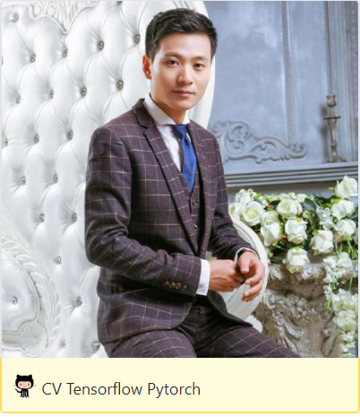

## 关于我
------

**徐静**：（[dataxujing](https://github.com/DataXujing)） 小白一个，AI图像算法研发工程师，数据科学爱好者，喜欢R, Python, C++ 关注机器学习，深度学习等AI领域； 喜欢网络爬虫，关注前端可视化; 对ASR(语音识别)，NLP(自然语言处理)，CV(计算机视觉)均有涉猎； 目前从事医疗影像AI算法的研究和落地工作。熟悉Python的GUI,Web开发。

## 关于课程

课程特点：

+ 完全基于Python,快速实现Windows,Linux, MacOs, ios, Android跨平台GUI，NUI APP开发
+ 融合机器学习，深度学习，计算机视觉项目实战

适合人群：

+ 有一定的C++,Python编程基础，对GUI开发有基础的了解
+ 熟悉机器学习，深度学习，特别是对深度学习的相关框架和算法有一定的了解，本课程设及框架TensorFlow,Pytorch
+ 了解计算机视觉相关算法，本课程项目设及： 人脸检测，物体边缘检测，生成对抗网络(GAN)，及OpenCV的相关算法

课程目标：

+ 实现基于Kivy的APP快速开发

课程设及实战项目：

+ 基于PyQt5的AI京剧换脸软件开发
+ 基于Kivy(kivymd)的涂鸦画板软件开发
+ 基于kivy的智能车道线检测APP开发
+ 基于kivymd的GAN一键现实转二次元动画场景迁移APP开发
+ kivy的安卓apk打包和Window可执行文件打包

本教程涉及所有源码下载: <https://github.com/DataXujing/create_apps_in_kivy>

 