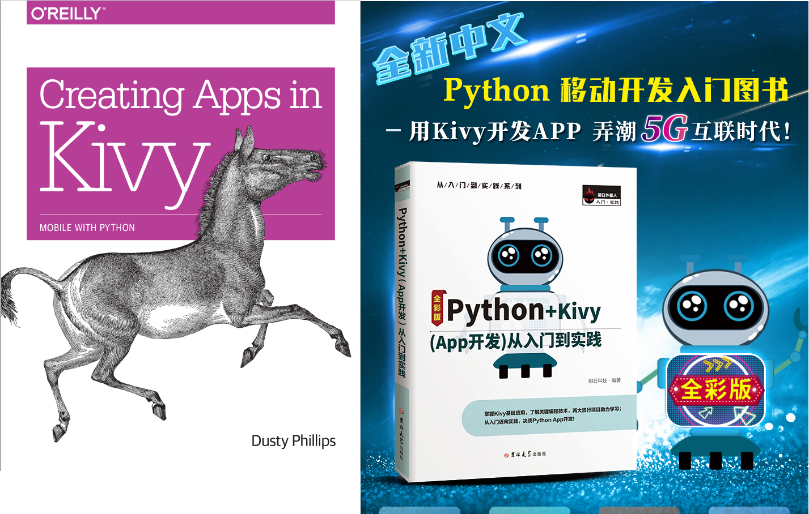

## 第一章 Kivy简介
------

 

**图1-1：Kivy logo**

### 1.kivy框架介绍及kivy与PyQt5

在Python中经常用于GUI开发的控件集有PyQt,Tkinter,wxPython,Kivy,PyGUI和Libavg.

kivy(NUI):

Kivy 是一个开源的 Python 框架(2011年)，用于快速开发应用，实现各种当前流行的用户界面，比如多点 触摸等等。 Kivy 可以运行于 Windows， Linux， MacOS， Android， iOS 等当前绝大部分主流桌面/移 动端操作系统。 Kivy 基于 Python，界面UI文件和程序文件相互分离的设计思路，设计简洁优雅，语法易学，适合新 人入门。 目前 Kivy 的官方文档还算很完善。

PyQt5(GUI):

PyQt5是一个用于创建GUI应用程序的跨平台的工具包，它将Python编程语言和Qt库成功融合在一起，PyQt5是由Phil Thompson开发的，实现了一个Python模块集，PyQt5拥有620多个类，将近6000个函数，PyQt也可以运行在所有的主流操作系统上,包括UNIX,Windows和MacOS

如果你开发一个基于PC的应用，你可以使用kivy和PyQt5均可以，如果你开发一个基于iOS或Android的应用，建议你使用kivy. 我们将在本节课的结束演示两种开发工具开发的简单的应用。

### 2.kivy学习资源介绍(包括 官网，中文文档，书籍，B站资源分享）

推荐书籍

 

推荐电子书

+ [Kivy中文编程指南0](https://cycleuser.gitbooks.io/kivy-guide-chinese/content/06-Kivy-Events%20and%20Properties.html)

+ [Kivy官方文档翻译](https://www.kancloud.cn/gthank/kivydoc/127793)

+ [kivy中文编程指南](https://www.bookstack.cn/read/Kivy-CN/README.md)

+ [kivy官方文档](https://kivy.org/#home)

+ [kivymd官方文档](https://kivymd.readthedocs.io/en/latest/)

+ [kivymd官方demo](https://github.com/HeaTTheatR/KivyMD/wiki)

B站资源

+ [python制作APP，kivy教程(中文字幕)](https://www.bilibili.com/video/BV1E4411Y74G?from=search&seid=4330403371925229218)

+ [使用python开发移动应用](https://www.bilibili.com/video/BV1JV411C7uF?from=search&seid=4330403371925229218)

+ [Kivy Tutorial - 使用python编写移动端app](https://www.bilibili.com/video/BV1g54y1Q7bV?from=search&seid=4330403371925229218)

+ [Building a POS System with Python and Kivy](https://www.bilibili.com/video/BV1bf4y1S7C3?from=search&seid=4330403371925229218)

### 3.kivymd的简单介绍

kivymd是与Kivy跨平台图形框架一起使用的与Material Design（材料设计语言）兼容的窗口小部件的集合， 该框架是用于跨平台，启用触摸的图形应用程序的框架。目标是在不牺牲易用性或应用程序性能的前提下，尽可能接近Google的Material Design规范。
使用kivymd可以使得在实现炫酷的应用的同时不会增加额外的代码量。

### 4.课程实现APP效果展示（包括PyQt5程序和本课程的程序)

+ PyQt5： AI京剧换脸项目

+ kivy: 智能车道线检测项目

+ kivymd: 二次元场景迁移项目

### 5.打包方式：3种android打包方式，pyinstaller和nuitka打包及其他们的优缺点

Android打包： 

+ kivy Launcher(不能生成apk安装包，我尝试了很多官方的例子都没有成功，我们也会为大家提供安卓包)
+ buildozer(官方推荐的打包方式，基于p4a)
+ p4a

PC打包：

+ pyinstaller
+ nuitka
