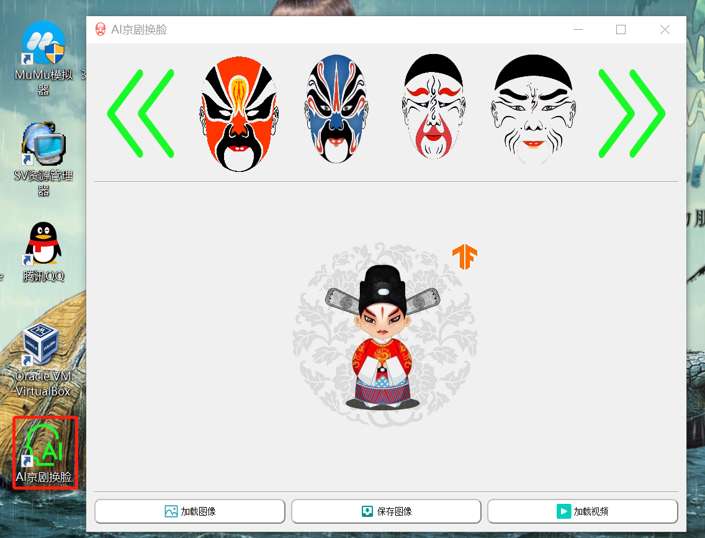
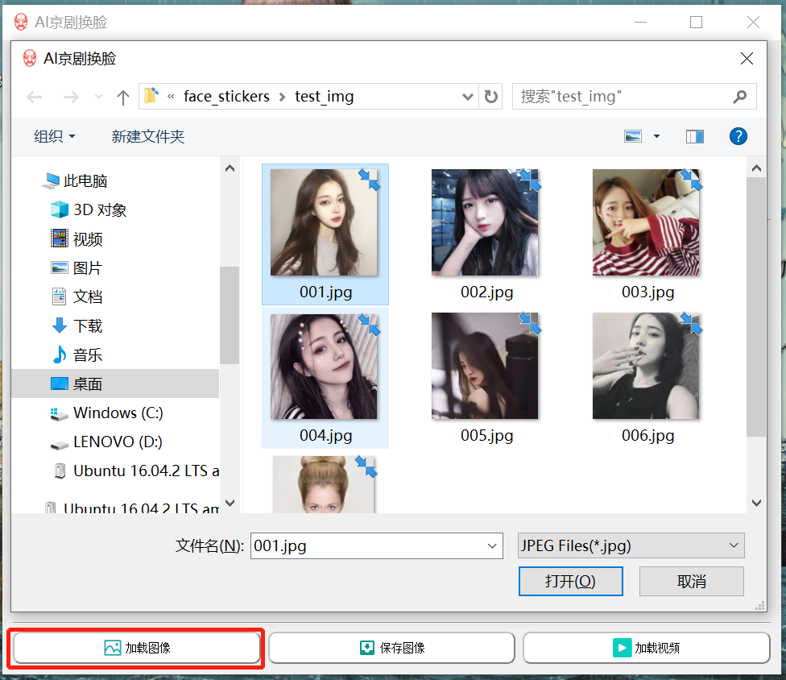

## 第十章 总结加项目展示

------

本课程中我们主要涉及到了4个项目：

+ 基于PyQt5的AI京剧换脸软件开发
+ 基于kivy(kivymd)的涂鸦画板软件开发
+ 基于kivy的智能车道线检测APP开发
+ 基于kivymd的GAN一键现实转二次元动画场景迁移APP开发


我们详细的分步骤介绍了每个项目的开发过程及在windows和android下的打包过程，最后我们在本次课将详细的演示我们上述涉及的项目在安卓手机的演示。


**手机桌面**
<div align=center>
 
</div>
<br>

**涂鸦画板**

<div align=center>
 
</div>
<br>

**涂鸦画板md**

<div align=center>
 
</div>
<br>

**智能车道线检测**

<div align=center>
 
</div>
<br>

**GAN风格迁移**

<div align=center>
 
</div>
<br>


### 最后的作业

基于kivy和kivymd实现二维码扫描识别的安卓应用！

<div align=center>
 
</div>


### 附件： 基于PyQt5的AI京剧换脸软件的源码和演示

为了展示PyQt5与Kivy的区别和联系，我们在最后附上基于PyQt5的AI京剧换脸的软件开发的源码和最后在Windows打包后的运行演示。

该项目开源地址<https://github.com/DataXujing/AI-Face-changing-in-Peking-Opera->欢迎star和fork!!!

基于PyQt5的AI京剧换脸项目列表：

<div align=center>
 
</div>

这里：

+ pb文件夹存放了tensorflow训练的人脸检测模型mtcnn
+ static文件夹存放了项目需要的图像等静态资源文件
+ `__init__.py`是包文件
+ `mtcmm.py`是人脸检测模型的调用
+ `my_main_ui.py`是槽函数
+ `my_main_ui.spec`是pyinstaller打包的配置文件
+ `,y_main_ui_gpu.spec`是pyinstaller打包的配置文件(在GPU下)
+ `my_pic.qrc，my_pic.py`是编译的二进制静态资源文件
+ `README.md`是项目的说明文档
+ `Ui_my_main_ui.py`是PyQt5的UI文件

我们就按照上述顺序，对涉及到的主要py文件进行展示

+ `mtcnn.py`

```python
import argparse

import tensorflow as tf
import cv2


# tensorflow = 1.9.0
class MTCNN:

    def __init__(self, model_path, min_size=40, factor=0.709, thresholds=[0.6, 0.7, 0.7]):
        self.min_size = min_size
        self.factor = factor
        self.thresholds = thresholds

        graph = tf.Graph()
        with graph.as_default():
            with open(model_path, 'rb') as f:
                graph_def = tf.GraphDef.FromString(f.read())
                tf.import_graph_def(graph_def, name='')
        self.graph = graph
        config = tf.ConfigProto(
            allow_soft_placement=True,
            intra_op_parallelism_threads=4,
            inter_op_parallelism_threads=4)
        config.gpu_options.allow_growth = True
        self.sess = tf.Session(graph=graph, config=config)

    def detect(self, img):
        feeds = {
            self.graph.get_operation_by_name('input').outputs[0]: img,
            self.graph.get_operation_by_name('min_size').outputs[0]: self.min_size,
            self.graph.get_operation_by_name('thresholds').outputs[0]: self.thresholds,
            self.graph.get_operation_by_name('factor').outputs[0]: self.factor
        }
        fetches = [self.graph.get_operation_by_name('prob').outputs[0],
                  self.graph.get_operation_by_name('landmarks').outputs[0],
                  self.graph.get_operation_by_name('box').outputs[0]]
        prob, landmarks, box = self.sess.run(fetches, feeds)
        return box, prob, landmarks


def main(args):
    mtcnn = MTCNN('./pb/mtcnn.pb')
    img = cv2.imread(args.image)

    bbox, scores, landmarks = mtcnn.detect(img)

    print('total box:', len(bbox))
    for box, pts in zip(bbox, landmarks):
        box = box.astype('int32')
        img = cv2.rectangle(img, (box[1], box[0]), (box[3], box[2]), (255, 0, 0), 3)

        pts = pts.astype('int32')
        for i in range(5):
            img = cv2.circle(img, (pts[i+5], pts[i]), 1, (0, 255, 0), 2)
    cv2.imshow('image', img)
    cv2.waitKey(0)


if __name__ == '__main__':
    parser = argparse.ArgumentParser(description='tensorflow mtcnn')
    parser.add_argument('image', help='image path')
    args = parser.parse_args()
    main(args)


```

+ `my_main_ui.py`

```python
# -*- coding: utf-8 -*-

"""
xujing
2020-06-17
mainwindow
"""

import PyQt5.QtCore
from PyQt5.QtCore import pyqtSlot
from PyQt5.QtWidgets import QMainWindow

from Ui_my_main_ui import Ui_MainWindow

from PyQt5.QtCore import *
from PyQt5.QtWidgets import  *
from PyQt5 import *
from PyQt5.QtGui import *
import sys
import time

import cv2
import numpy as np
from PIL import Image
from mtcnn import MTCNN
from numba import jit, prange

# import qdarkstyle
# dark_stylesheet = qdarkstyle.load_stylesheet_pyqt5()


# 仿射变换，用于将贴图点映射到人脸点,得到变换矩阵M
def get_text_trans_matrix(x1, y1, x2, y2, x3, y3, tx1, ty1, tx2, ty2, tx3, ty3):
    '''
    src：原始图像中的三个点的坐标
    dst：变换后的这三个点对应的坐标
    M：根据三个对应点求出的仿射变换矩阵2X3
    '''
    # 放射变换
    return cv2.getAffineTransform( np.float32([ [tx1, ty1], [tx2, ty2], [tx3, ty3] ]), np.float32( [ [x1, y1], [x2, y2], [x3, y3] ]) ).flatten() # 按行拉直
    # 透视变换
    # return cv2.getPerspectiveTransform( np.float32([ [tx1, ty1], [tx2, ty2], [tx3, ty3] ]), np.float32( [ [x1, y1], [x2, y2], [x3, y3] ]) ).flatten()

@jit(nopython=True)
def sticker(srcData, width, height, stride, mask, maskWidth, maskHeight, maskStride, srcFacePoints, maskFacePoints, H):
    def CLIP3(x, a, b):
        return min(max(a,x), b)
    # 用于将贴图点映射到人脸点 
    for i in range(height):
    # for i in prange(height):
        for j in range(width):
            x = float(i)
            y = float(j)
            tx = (int)((H[0] * (x)+H[1] * (y)+H[2]) + 0.5)
            ty = (int)((H[3] * (x)+H[4] * (y)+H[5]) + 0.5)
            tx = CLIP3(tx, 0, maskHeight - 1)
            ty = CLIP3(ty, 0, maskWidth - 1)

            mr = int( mask[ int(tx), int(ty), 0 ] ) 
            mg = int( mask[ int(tx), int(ty), 1 ] ) 
            mb = int( mask[ int(tx), int(ty), 2 ] ) 
            alpha = int( mask[ int(tx), int(ty), 3 ] )  
            #if alpha!=0:
            #    print( '>>>', alpha )
            b = srcData[i, j, 0]
            g = srcData[i, j, 1]
            r = srcData[i, j, 2]        
            srcData[i, j, 0] =CLIP3((b * (255 - alpha) + mb * alpha) / 255, 0, 255)
            srcData[i, j, 1] =CLIP3((g * (255 - alpha) + mg * alpha) / 255, 0, 255)
            srcData[i, j, 2] =CLIP3((r * (255 - alpha) + mr * alpha) / 255, 0, 255)
    return srcData


# @jit(parallel=True,nogil=True)
# @njit(parallel=True,nogil=True)
def trent_sticker(srcData, width, height, stride, mask, maskWidth, maskHeight, maskStride, srcFacePoints, maskFacePoints, ratio):
    ret = 0
    H = get_text_trans_matrix( maskFacePoints[0], maskFacePoints[1],maskFacePoints[2],maskFacePoints[3],maskFacePoints[4],maskFacePoints[5], srcFacePoints[0], srcFacePoints[1],srcFacePoints[2],srcFacePoints[3],srcFacePoints[4],srcFacePoints[5] )
    #print ('H', H) 
    srcData = sticker(srcData, width, height, stride, mask, maskWidth, maskHeight, maskStride, srcFacePoints, maskFacePoints, H)
    return srcData, ret 

# 京剧脸谱配置
face_key_point = {
    "01": [ 958.0,599.0, 958.0,1083.0, 1516.0,838.0 ],
    "02": [ 182.0,155.0, 182.0,243.0, 290.0,199.0 ],
    "03": [ 249.0,224.0, 247.0,342.0, 392.0,247.0 ],
    "04": [ 232.0,136.0, 232.0,267.0, 378.0,200.0 ],
    "05": [ 241.0,189.0, 241.0,323.0, 405.0,253.0 ],
    "06": [ 237.0,159.0, 237.0,284.0, 381.0,213.0 ],
    "07": [ 256.0,219.0, 256.0,342.0, 405.0,281.0 ],
    "08": [ 217.0,185.0, 217.0,298.0, 356.0,243.0 ],
    "09": [ 391.0,223.0, 391.0,428.0, 652.0,324.0 ],
    "10": [ 197.0,203.0, 197.0,313.0, 329.0,249.0 ],
    "11": [ 153.0,98.0, 153.0,164.0, 232.0,129.0 ],
    "12": [ 248.0,216.0, 248.0,345.0, 402.0,280.0 ],
    "13": [ 264.0,177.0, 264.0,325.0, 459.0,252.0 ],
    "14": [ 290.0,171.0, 290.0,333.0, 478.0,250.0 ],
    "15": [ 154.0,105.0, 154.0,196.0, 271.0,149.0]
    }


class MainWindow(QMainWindow, Ui_MainWindow):
    """
    Class documentation goes here.
    """
    def __init__(self, parent=None):
        """
        Constructor
        
        @param parent reference to the parent widget
        @type QWidget
        """
        super(MainWindow, self).__init__(parent)
        self.setupUi(self)

        self.left_button = 0
        self.right_button = 4
        QToolTip.setFont(QFont('SansSerif', 40))

        self.my_face_choose = "01"
        self.label.mylabelSig.connect(self.label_choose)
        self.label_2.mylabelSig.connect(self.label_2_choose)
        self.label_3.mylabelSig.connect(self.label_3_choose)
        self.label_4.mylabelSig.connect(self.label_4_choose)


    def label_choose(self):
        # self.label.setStyleSheet("")
        self.label_2.setText("")
        self.label_3.setText("")
        self.label_4.setText("")

        pe = QPalette()
        pe.setColor(QPalette.WindowText,Qt.green)#设置字体颜色
        self.label.setPalette(pe)

        self.label.setAlignment(Qt.AlignCenter)
        self.label.setFont(QFont("Roman times",20,QFont.Bold))

        try:
            self.label.setText("<b>选择: %02d</b>"%self.face_1[0])
            self.my_face_choose = "%02d"%self.face_1[0]
        except:
            self.label.setText("<b>选择: 01</b>")

    def label_2_choose(self):
        # self.label.setStyleSheet("")
        self.label.setText("")
        self.label_3.setText("")
        self.label_4.setText("")

        pe = QPalette()
        pe.setColor(QPalette.WindowText,Qt.green)#设置字体颜色
        self.label_2.setPalette(pe)

        self.label_2.setAlignment(Qt.AlignCenter)
        self.label_2.setFont(QFont("Roman times",20,QFont.Bold))

        try:
            self.label_2.setText("<b>选择: %02d</b>"%self.face_2[0])
            self.my_face_choose = "%02d"%self.face_2[0]
        except:
            self.label_2.setText("<b>选择: 02</b>")
            self.my_face_choose = "02"

    def label_3_choose(self):
        # self.label.setStyleSheet("")
        self.label_2.setText("")
        self.label.setText("")
        self.label_4.setText("")

        pe = QPalette()
        pe.setColor(QPalette.WindowText,Qt.green)#设置字体颜色
        self.label_3.setPalette(pe)

        self.label_3.setAlignment(Qt.AlignCenter)
        self.label_3.setFont(QFont("Roman times",20,QFont.Bold))

        try:
            self.label_3.setText("<b>选择: %02d</b>"%self.face_3[0])
            self.my_face_choose = "%02d"%self.face_3[0]
        except:
            self.label_3.setText("<b>选择: 03</b>")
            self.my_face_choose = "03"

    def label_4_choose(self):
        # self.label.setStyleSheet("")
        self.label_2.setText("")
        self.label_3.setText("")
        self.label.setText("")

        pe = QPalette()
        pe.setColor(QPalette.WindowText,Qt.green)#设置字体颜色
        self.label_4.setPalette(pe)

        self.label_4.setAlignment(Qt.AlignCenter)
        self.label_4.setFont(QFont("Roman times",20,QFont.Bold))

        try:
            self.label_4.setText("<b>选择: %02d</b>"%self.face_4[0])
            self.my_face_choose = "%02d"%self.face_4[0]
        except:
            self.label_4.setText("<b>选择: 04</b>")
            self.my_face_choose = "04"


    
    @pyqtSlot()
    def on_pushButton_clicked(self):
        """
        左翻页
        """

        if self.right_button == 4:
            self.left_button += 1

            self.face_1 = [self.left_button+1 if self.left_button <= 11 else 12]
            self.face_2 = [self.left_button+2 if self.left_button <= 12 else 13]
            self.face_3 = [self.left_button+3 if self.left_button <= 13 else 14]
            self.face_4 = [self.left_button+4 if self.left_button <= 14 else 15]
        else:
            self.face_1 = [self.face_1[0]+1]
            self.face_2 = [self.face_2[0]+1]
            self.face_3 = [self.face_3[0]+1]
            self.face_4 = [self.face_4[0]+1]


        self.label.setStyleSheet("border-image: url(:/my_pic/pic/mask/%02d.png);"%self.face_1[0])
        self.label_2.setStyleSheet("border-image: url(:/my_pic/pic/mask/%02d.png);"%self.face_2[0])
        self.label_3.setStyleSheet("border-image: url(:/my_pic/pic/mask/%02d.png);"%self.face_3[0])
        self.label_4.setStyleSheet("border-image: url(:/my_pic/pic/mask/%02d.png);"%self.face_4[0])

        self.label.setToolTip("<b>%02d</b>"%self.face_1[0])
        self.label_2.setToolTip("<b>%02d</b>"%self.face_2[0])
        self.label_3.setToolTip("<b>%02d</b>"%self.face_3[0])
        self.label_4.setToolTip("<b>%02d</b>"%self.face_4[0])

    @pyqtSlot()
    def on_pushButton_2_clicked(self):
        """
        "右翻页"
        """

        if self.left_button == 0:
            self.right_button += 1
   
            self.face_1 = [self.right_button-4 if self.right_button > 4 else 1]
            self.face_2 = [self.right_button-3 if self.right_button > 3 else 2]
            self.face_3 = [self.right_button-2 if self.right_button > 2 else 3]
            self.face_4 = [self.right_button-1 if self.right_button > 1 else 4]
        else:
            self.face_1 = [self.face_1[0]-1]
            self.face_2 = [self.face_2[0]-1]
            self.face_3 = [self.face_3[0]-1]
            self.face_4 = [self.face_4[0]-1]


        self.label.setStyleSheet("border-image: url(:/my_pic/pic/mask/%02d.png);"%self.face_1[0])
        self.label_2.setStyleSheet("border-image: url(:/my_pic/pic/mask/%02d.png);"%self.face_2[0])
        self.label_3.setStyleSheet("border-image: url(:/my_pic/pic/mask/%02d.png);"%self.face_3[0])
        self.label_4.setStyleSheet("border-image: url(:/my_pic/pic/mask/%02d.png);"%self.face_4[0])

        self.label.setToolTip("<b>%02d</b>"%self.face_1[0])
        self.label_2.setToolTip("<b>%02d</b>"%self.face_2[0])
        self.label_3.setToolTip("<b>%02d</b>"%self.face_3[0])
        self.label_4.setToolTip("<b>%02d</b>"%self.face_4[0])


    
    @pyqtSlot()
    def on_pushButton_3_clicked(self):
        """
        AI人脸识别 + 仿射变换
        """
        jingju = self.my_face_choose
        self.my_face_choose = "01"
        self.label.setText("")
        self.label_2.setText("")
        self.label_3.setText("")
        self.label_4.setText("")
        print(jingju)

        img = Image.open("./static/{}.png".format(jingju)) 

        r,g,b,a=img.split()   #分离4通道 
        im_array = np.array(img) 
        # 高宽通道 (坐标取值为y, x) 
        mask_h, mask_w, mask_c = im_array.shape 

        try:
            # img = cv2.imread( './test_img/001.jpg' )
            openfile_name = QFileDialog.getOpenFileName(self,'AI京剧换脸','','JPEG Files(*.jpg);;PNG Files(*.png);;PGM Files(*.pgm)')
          
            img = cv2.imread( openfile_name[0] )
            # 高宽通道 (坐标取值为y, x)
            h, w, c = img.shape
            bbox, scores, landmarks = mtcnn.detect(img)
          
            for box, pts in zip(bbox, landmarks):
                faceInfos = np.array( [ 1, box[1], box[0], box[3] - box[1], box[2] - box[0], pts[5], pts[0], pts[6], pts[1], pts[7], pts[2], pts[8], pts[3], pts[9], pts[4] ] )


            srcFacePoints = np.array( [faceInfos[6], faceInfos[5], faceInfos[8], faceInfos[7], (faceInfos[12]+faceInfos[14])/2.0, (faceInfos[11] + faceInfos[13])/2.0 ] ) 
            print ('srcFacePoints:', srcFacePoints) 

           
            maskFacePoints = np.array(face_key_point[jingju]) 
            print ('maskFacePoints:', maskFacePoints)

            # start_time = time.time()
            srcData, ret  = trent_sticker( img, w, h, 3, im_array, mask_w, mask_h, 4, srcFacePoints, maskFacePoints, 100 ) 
            # print ( 'time >>>>', time.time() - start_time )
            img_mask = np.array(srcData, dtype=np.uint8) 
            # cv2.imwrite('res.jpg', img_mask)

            bytesPerLine = c * w

            cv2.cvtColor(img, cv2.COLOR_BGR2RGB, img)
            QImg = QImage(img.data, w, h,bytesPerLine, QImage.Format_RGB888)
            self.label_6.setAlignment(Qt.AlignCenter)
            self.label_6.setPixmap(QPixmap.fromImage(QImg).scaled(self.label_6.size(), Qt.KeepAspectRatio, Qt.SmoothTransformation))

            self.save_img = cv2.cvtColor(img, cv2.COLOR_RGB2BGR)
        except Exception as e:
            print(e)


    @pyqtSlot()
    def on_pushButton_5_clicked(self):
        """
        TODO: 视频流
        """

        QMessageBox.information(self,
                                    "AI京剧换脸 消息",  
                                    "目前不提供视频应用！",  
                                    QMessageBox.Yes | QMessageBox.No)
    
    @pyqtSlot()
    def on_pushButton_4_clicked(self):
        """
        下载图像
        """

        try:
            filename=QFileDialog.getSaveFileName(self,'AI京剧换脸 保存','','JPEG Files(*.jpg);;PNG Files(*.png);;PGM Files(*.pgm)')
            cv2.imwrite(filename[0],self.save_img)
        except:
            QMessageBox.warning(self,
                                    "AI京剧换脸 警告",  
                                    "没有需要下载保存的图片！",  
                                    QMessageBox.Yes | QMessageBox.No)


if __name__ == "__main__":

    app = QtWidgets.QApplication(sys.argv)
    # app.setStyleSheet(dark_stylesheet)
    
    splash = QSplashScreen(QtGui.QPixmap(':/my_pic/pic/face.png'))
    # splash = MySplashScreen('./pic/face.gif', Qt.WindowStaysOnTopHint)
    splash.show()
    splash.showMessage('渲染界面...')
    # QThread.sleep(0.5)
    time.sleep(0.5)
    splash.showMessage('正在初始化程序...')
    mtcnn = MTCNN('./pb/mtcnn.pb')   # 实例化MTCNN
    app. processEvents()
    ui =MainWindow()
    ui.show()
    splash.finish(ui)
    sys.exit(app.exec_())

```


+ `my_mian_ui.spec`

```

# -*- mode: python ; coding: utf-8 -*-

import sys
sys.setrecursionlimit(5000)

block_cipher = None


a = Analysis(['my_main_ui.py'],
             pathex=['C:\\Users\\xujing.LAPTOP-LLR84L1D\\Desktop\\Face_AI'],
             binaries=[],
             datas=[],
             hiddenimports=[],
             hookspath=[],
             runtime_hooks=[],
             excludes=[],
             win_no_prefer_redirects=False,
             win_private_assemblies=False,
             cipher=block_cipher,
             noarchive=False)
pyz = PYZ(a.pure, a.zipped_data,
             cipher=block_cipher)
exe = EXE(pyz,
          a.scripts,
          [],
          exclude_binaries=True,
          name='my_main_ui',
          debug=False,
          bootloader_ignore_signals=False,
          strip=False,
          upx=True,
          console=False , icon='icon.ico')
coll = COLLECT(exe,
               a.binaries,
               a.zipfiles,
               a.datas,
               strip=False,
               upx=True,
               upx_exclude=[],
               name='my_main_ui')

```

+ `Ui_my_main_ui.py`


```python


# -*- coding: utf-8 -*-

'''
Created by: PyQt5 UI code generator 5.15.0

xujing
2020-06-17
ui mainwindow
'''

from PyQt5 import QtCore, QtGui, QtWidgets

from PyQt5 import QtCore, QtGui, QtWidgets
from PyQt5.QtGui import *
from PyQt5.QtCore import *
import sys
 
from PyQt5.QtWidgets import QLabel
from PyQt5.QtCore import pyqtSignal
 
 
class MyLabel(QLabel):
    '''
    重写label，增加单击的信号函数
    '''
    mylabelSig = pyqtSignal(str)
    # mylabelDoubleClickSig = pyqtSignal(str)
 
    def __int__(self):
        super(MyLabel, self).__init__()
 
    def mousePressEvent(self, e):    # 单击
        sigContent = self.objectName()
        self.mylabelSig.emit(sigContent)
 
class Ui_MainWindow(object):
    def setupUi(self, MainWindow):
        button_style = ''' 
         QPushButton
         {text-align : center;
         background-color : white;
         font: bold;
         border-color: gray;
         border-width: 2px;
         border-radius: 10px;
         padding: 6px;
         height : 14px;
         border-style: outset;
         font : 14px;}
         QPushButton:pressed
         {text-align : center;
         background-color : light gray;
         font: bold;
         border-color: gray;
         border-width: 2px;
         border-radius: 10px;
         padding: 6px;
         height : 14px;
         border-style: outset;
         font : 14px;}
        '''

        MainWindow.setObjectName("MainWindow")
        MainWindow.resize(967, 787)
        icon = QtGui.QIcon()
        icon.addPixmap(QtGui.QPixmap(":/my_pic/pic/脸谱.png"), QtGui.QIcon.Normal, QtGui.QIcon.Off)
        MainWindow.setWindowIcon(icon)
        self.centralWidget = QtWidgets.QWidget(MainWindow)
        self.centralWidget.setObjectName("centralWidget")
        self.gridLayout = QtWidgets.QGridLayout(self.centralWidget)
        self.gridLayout.setObjectName("gridLayout")
        self.horizontalLayout = QtWidgets.QHBoxLayout()
        self.horizontalLayout.setObjectName("horizontalLayout")
        self.pushButton = QtWidgets.QPushButton(self.centralWidget)
        self.pushButton.setMinimumSize(QtCore.QSize(149, 200))
        self.pushButton.setStyleSheet("border-image: url(:/my_pic/pic/左翻页.png);")
        self.pushButton.setText("")
        self.pushButton.setObjectName("pushButton")
        self.horizontalLayout.addWidget(self.pushButton)
        # self.label = QtWidgets.QLabel(self.centralWidget)
        self.label = MyLabel()
        self.label.setMinimumSize(QtCore.QSize(131, 179))
        self.label.setMaximumSize(QtCore.QSize(262, 682))
        self.label.setStyleSheet("border-image: url(:/my_pic/pic/mask/01.png);")
        self.label.setText("")
        self.label.setObjectName("label")
        self.horizontalLayout.addWidget(self.label)
        # self.label_2 = QtWidgets.QLabel(self.centralWidget)
        self.label_2 = MyLabel()
        self.label_2.setMaximumSize(QtCore.QSize(298, 682))
        self.label_2.setStyleSheet("border-image: url(:/my_pic/pic/mask/02.png);")
        self.label_2.setText("")
        self.label_2.setObjectName("label_2")
        self.horizontalLayout.addWidget(self.label_2)
        # self.label_3 = QtWidgets.QLabel(self.centralWidget)
        self.label_3 = MyLabel()
        self.label_3.setMaximumSize(QtCore.QSize(298, 682))
        self.label_3.setStyleSheet("border-image: url(:/my_pic/pic/mask/03.png);")
        self.label_3.setText("")
        self.label_3.setObjectName("label_3")
        self.horizontalLayout.addWidget(self.label_3)
        # self.label_4 = QtWidgets.QLabel(self.centralWidget)
        self.label_4 = MyLabel()
        self.label_4.setMaximumSize(QtCore.QSize(298, 682))
        self.label_4.setStyleSheet("border-image: url(:/my_pic/pic/mask/04.png);")
        self.label_4.setText("")
        self.label_4.setObjectName("label_4")
        self.horizontalLayout.addWidget(self.label_4)
        self.pushButton_2 = QtWidgets.QPushButton(self.centralWidget)
        self.pushButton_2.setMinimumSize(QtCore.QSize(149, 200))
        self.pushButton_2.setStyleSheet("border-image: url(:/my_pic/pic/右翻页.png);")
        self.pushButton_2.setText("")
        self.pushButton_2.setObjectName("pushButton_2")
        self.horizontalLayout.addWidget(self.pushButton_2)
        self.gridLayout.addLayout(self.horizontalLayout, 0, 0, 1, 3)
        self.line = QtWidgets.QFrame(self.centralWidget)
        self.line.setFrameShape(QtWidgets.QFrame.HLine)
        self.line.setFrameShadow(QtWidgets.QFrame.Sunken)
        self.line.setObjectName("line")
        self.gridLayout.addWidget(self.line, 1, 0, 1, 3)
        self.label_6 = QtWidgets.QLabel(self.centralWidget)
        self.label_6.setMaximumSize(QtCore.QSize(1882, 684))
        self.label_6.setStyleSheet("image: url(:/my_pic/pic/face.png);")
        self.label_6.setText("")
        self.label_6.setObjectName("label_6")
        self.gridLayout.addWidget(self.label_6, 2, 0, 1, 3)
        self.pushButton_3 = QtWidgets.QPushButton(self.centralWidget)
        self.pushButton_3.setStyleSheet(button_style)
        self.pushButton_3.setMinimumSize(QtCore.QSize(200, 40))
        icon1 = QtGui.QIcon()
        icon1.addPixmap(QtGui.QPixmap(":/my_pic/pic/图片.png"), QtGui.QIcon.Normal, QtGui.QIcon.Off)
        self.pushButton_3.setIcon(icon1)
        self.pushButton_3.setObjectName("pushButton_3")
        self.gridLayout.addWidget(self.pushButton_3, 4, 0, 1, 1)
        self.pushButton_5 = QtWidgets.QPushButton(self.centralWidget)
        self.pushButton_5.setStyleSheet(button_style)
        self.pushButton_5.setMinimumSize(QtCore.QSize(200, 40))
        icon2 = QtGui.QIcon()
        icon2.addPixmap(QtGui.QPixmap(":/my_pic/pic/视频.png"), QtGui.QIcon.Normal, QtGui.QIcon.Off)
        self.pushButton_5.setIcon(icon2)
        self.pushButton_5.setObjectName("pushButton_5")
        self.gridLayout.addWidget(self.pushButton_5, 4, 2, 1, 1)
        self.line_2 = QtWidgets.QFrame(self.centralWidget)
        self.line_2.setFrameShape(QtWidgets.QFrame.HLine)
        self.line_2.setFrameShadow(QtWidgets.QFrame.Sunken)
        self.line_2.setObjectName("line_2")
        self.gridLayout.addWidget(self.line_2, 3, 0, 1, 3)
        self.pushButton_4 = QtWidgets.QPushButton(self.centralWidget)
        self.pushButton_4.setStyleSheet(button_style)
        self.pushButton_4.setMinimumSize(QtCore.QSize(200, 40))
        icon3 = QtGui.QIcon()
        icon3.addPixmap(QtGui.QPixmap(":/my_pic/pic/下载 绿色.png"), QtGui.QIcon.Normal, QtGui.QIcon.Off)
        self.pushButton_4.setIcon(icon3)
        self.pushButton_4.setObjectName("pushButton_4")
        self.gridLayout.addWidget(self.pushButton_4, 4, 1, 1, 1)
        MainWindow.setCentralWidget(self.centralWidget)

        self.retranslateUi(MainWindow)
        QtCore.QMetaObject.connectSlotsByName(MainWindow)

    def retranslateUi(self, MainWindow):
        _translate = QtCore.QCoreApplication.translate
        MainWindow.setWindowTitle(_translate("MainWindow", "AI京剧换脸"))
        self.pushButton_3.setText(_translate("MainWindow", "加载图像"))
        self.pushButton_5.setText(_translate("MainWindow", "加载视频"))
        self.pushButton_4.setText(_translate("MainWindow", "保存图像"))
import my_pic_rc


if __name__ == "__main__":
    import sys
    app = QtWidgets.QApplication(sys.argv)
    MainWindow = QtWidgets.QMainWindow()
    ui = Ui_MainWindow()
    ui.setupUi(MainWindow)
    MainWindow.show()
    sys.exit(app.exec_())

```

按照第6章和第7章的打包方式，打包安装后的运行效果：

查看在电脑的安装情况

<div align=center>
 
</div>
<br>


<div align=center>
 
</div>
<br>

运行：


<div align=center>
 
</div>
<br>


<div align=center>
 
</div>
<br>


<div align=center>
 
</div>
<br>


<div align=center>
 
</div>
<br>


<div align=center>
 
</div>
<br>

保存的图片：


<div align=center>
 
</div>
<br>

<div align=center>
 
</div>
<br>


<div align=center>
 
</div>
<br>