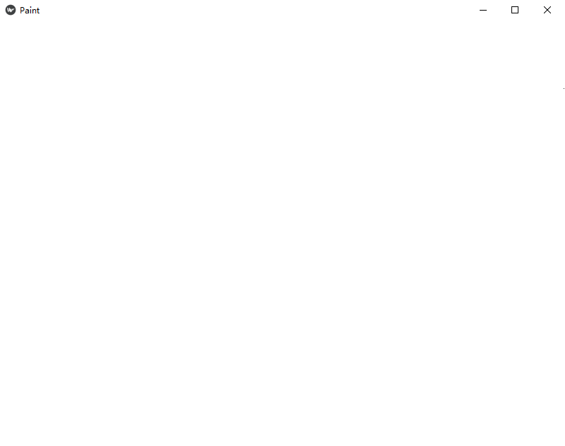
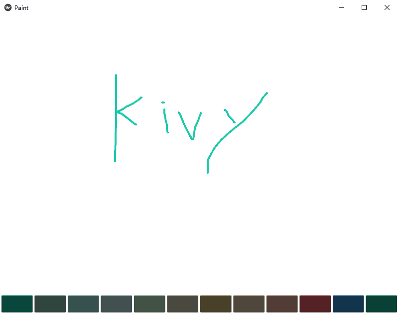

## 第二章 涂鸦画板项目基于kivy实现

------

### 1.项目展示与显示画笔的轨迹

想要显示绘图的轨迹，首先需要构造出一个窗口，让其加载`.kv`文件，并在`.kv`文件中把页面背景设置为白色

**step1: 新建一个`main.py`文件，在其中先简单的加载`.kv`文件，具体代码如下**

```python
from kivy.app import App
from kivy.graphics import Line, Color
from kivy.uix.widget import Widget


class DrawCanvasWidget(Widget):
	def __init__(self,**kwargs):
		super().__init__(**kwargs)


class PaintApp(App):
	def build(self):
		self.draw_canvas_widget = DrawCanvasWidget()

		return self.draw_canvas_widget  # 返回root控件

if __name__ == "__main__":
	PaintApp().run()

```
这时候运行效果(什么也没有，以为我们并没有定义任何控件和绘图在界面）：

<div align=center>
 
</div>


**step2: 创建和APP同名的`.kv`文件,设置窗口的一些属性**

```
# 注意paint.kv文件中不能出现中文和类似于python的注释
<DrawCanvasWidget>  # 定义页面
	canvas.before:
		Color:      # 颜色
			rgba: [1,1,1,1]
		Rectangle:  #形状
			pos: self.pos
			size: self.size

```
<div align=center>
 
</div>


**step3：监听屏幕的点击和移动触发事件**

```python

from kivy.app import App
from kivy.graphics import Line, Color
from kivy.uix.widget import Widget


class DrawCanvasWidget(Widget):
	def __init__(self,**kwargs):
		super().__init__(**kwargs)
		# 默认划线的颜色
		self.canvas.add(Color(rgb=[0,0,0]))
		self.line_width = 2

	def on_touch_down(self,touch):
		if Widget.on_touch_down(self,touch):
			return
		with self.canvas:
			#User data dictionary. Use this dictionary to save your own data on the touch
			touc.ud['current_line'] = Line(points=(touch.x,touch.y),width=self.line_width)

	def on_touch_move(self,touch):
		if 'current_line' in touch.ud:
			touch.ud['current_line'].points += (touch.x,touch.y)


class PaintApp(App):
	def build(self):
		self.draw_canvas_widget = DrawCanvasWidget()

		return self.draw_canvas_widget  # 返回root控件

if __name__ == "__main__":
	PaintApp().run()

```


<div align=center>
 
</div>

### 2.设置颜色的Button

该部分我们通过button实现点击button切换划线的颜色，上一节中我们仅仅定义了了默认的画板颜色。

首先我们在`paint.kv`中添加12种颜色的button

```
#: import C kivy.utils.get_color_from_hex

<BottomColorButton@ToggleButton>:
    group: 'color'  
    border: (3,3,3,3) 
    on_release: app.draw_canvas_widget.change_color(self.background_color)

<DrawCanvasWidget>:
    canvas.before:
        Color: 
            rgba: [1,1,1,1]
        Rectangle:
            pos: self.pos
            size: self.size

    BoxLayout:
        id: bottom_box
        orientation: "horizontal"
        padding: 2
        spacing: 2
        size: root.width,40

        BottomColorButton:
            background_color: C("#19caad")
            state: 'down'
        BottomColorButton:
            background_color: C("#8cc7b5")
        BottomColorButton:
            background_color: C("#a0eee1")
        BottomColorButton:
            background_color: C("#bee7e9")
        BottomColorButton:
            background_color: C("#beedc7")
        BottomColorButton:
            background_color: C("#d6d5b7")
        BottomColorButton:
            background_color: C("#d1ba74")
        BottomColorButton:
            background_color: C("#e6ceac")
        BottomColorButton:
            background_color: C("#ecad9e")
        BottomColorButton:
            background_color: C("#f4606c")
        BottomColorButton:
            background_color: C("#3498db")
        BottomColorButton:
            background_color: C("#1abc9c")


```

```python
from kivy.app import App
from kivy.graphics import Line, Color
from kivy.uix.widget import Widget

from kivy.uix.behaviors import ToggleButtonBehavior
from kivy.uix.togglebutton import ToggleButton


class DrawCanvasWidget(Widget):
    def __init__(self,**kwargs):
        super().__init__(**kwargs)
        # 默认划线的颜色
        self.canvas.add(Color(rgb=[0,0,0]))
        self.line_width = 2

    def on_touch_down(self,touch):
        if Widget.on_touch_down(self,touch):
            return
        with self.canvas:
            touch.ud['current_line'] = Line(points=(touch.x,touch.y),width=self.line_width)

    def on_touch_move(self,touch):
        if 'current_line' in touch.ud:
            touch.ud['current_line'].points += (touch.x,touch.y)
    # 增加该方法改变颜色
    def change_color(self,new_color):
        self.canvas.add(Color(*new_color))


class PaintApp(App):
    def build(self):
        self.draw_canvas_widget = DrawCanvasWidget()

        return self.draw_canvas_widget  # 返回root控件

if __name__ == "__main__":
    PaintApp().run()
```

<div align=center>
 
</div>


### 3.设置线宽的Button

目前线宽仅仅在初始化时作了设置，改变线宽和改变颜色设置方式一致，在root控件中创建一个改变线宽的方法

```python

from kivy.app import App
from kivy.graphics import Line, Color
from kivy.uix.widget import Widget

from kivy.uix.behaviors import ToggleButtonBehavior
from kivy.uix.togglebutton import ToggleButton
from kivy.utils import get_color_from_hex

class DrawCanvasWidget(Widget):
    def __init__(self,**kwargs):
        super().__init__(**kwargs)
        # 默认划线的颜色
        self.canvas.add(Color(rgb=[0,0,0]))
        self.line_width = 2

    def on_touch_down(self,touch):
        if Widget.on_touch_down(self,touch):
            return
        with self.canvas:
            touch.ud['current_line'] = Line(points=(touch.x,touch.y),width=self.line_width)

    def on_touch_move(self,touch):
        if 'current_line' in touch.ud:
            touch.ud['current_line'].points += (touch.x,touch.y)

    def change_color(self,new_color):
        self.canvas.add(Color(*new_color))
    # 增加该方法，改变线宽
    def change_line_width(self,line_width="Normal"):
        self.line_width = {"Thin":1,"Normal":2,"Thick":4}[line_width]


class PaintApp(App):
    def build(self):
        self.draw_canvas_widget = DrawCanvasWidget()

        return self.draw_canvas_widget  # 返回root控件

if __name__ == "__main__":
    PaintApp().run()
```

然后我们在`paint.kv`中设置改变线宽的button

```
#: import C kivy.utils.get_color_from_hex

<BottomColorButton@ToggleButton>:
    group: 'color' 
    background_normal: ''  # 标准背景颜色
    background_down: ''    # 选中后的背景颜色
    border: (3,3,3,3) 
    on_release: app.draw_canvas_widget.change_color(self.background_color)

<LineWidthButton@ToggleButton>:
    group: "line_width"
    color: C("#2c3e50")
    background_color: C("#ecf0f1")
    background_normal: ''
    background_down: ''
    border: (3,3,3,3)
    on_release: app.draw_canvas_widget.change_line_width(self.text)

<DrawCanvasWidget>:
    canvas.before:
        Color: 
            rgba: [1,1,1,1]
        Rectangle:
            pos: self.pos
            size: self.size

    BoxLayout:
        orientation: "horizontal"
        padding: 2
        spacing: 2
        x: 0
        top: root.top
        size_hint: None,None
        size: 280,44

        LineWidthButton:
            text: "Thin"

        LineWidthButton:
            text: "Normal"
            state: "down"
        LineWidthButton:
            text: "Thick"


    BoxLayout:
        id: bottom_box
        orientation: "horizontal"
        padding: 2
        spacing: 2
        size: root.width,40

        BottomColorButton:
            background_color: C("#19caad")
            state: 'down'
        BottomColorButton:
            background_color: C("#8cc7b5")
        BottomColorButton:
            background_color: C("#a0eee1")
        BottomColorButton:
            background_color: C("#bee7e9")
        BottomColorButton:
            background_color: C("#beedc7")
        BottomColorButton:
            background_color: C("#d6d5b7")
        BottomColorButton:
            background_color: C("#d1ba74")
        BottomColorButton:
            background_color: C("#e6ceac")
        BottomColorButton:
            background_color: C("#ecad9e")
        BottomColorButton:
            background_color: C("#f4606c")
        BottomColorButton:
            background_color: C("#3498db")
        BottomColorButton:
            background_color: C("#1abc9c")

```

<div align=center>
 
</div>


### 4.按钮边框的设置

选中了颜色和线宽后，我们无法知道我们目前到底选中的是哪个颜色，是哪个线宽，因此我们为选中的button添加一些样式，这里我们给选中的butoon外面添加一个边框。
修改`paint.kv`

```
#: import C kivy.utils.get_color_from_hex

<BottomColorButton@ToggleButton>:
    group: 'color' 
    background_normal: 'radio_background_normal.png'  # 未选中时的样式
    background_down: 'radio_background_down.png'      # 选中后的样式
    border: (3,3,3,3) 
    on_release: app.draw_canvas_widget.change_color(self.background_color)

<LineWidthButton@ToggleButton>:
    group: "line_width"
    color: C("#2c3e50")
    background_color: C("#ecf0f1")
    background_normal: 'radio_background_normal.png'
    background_down: 'radio_background_down.png'
    border: (3,3,3,3)
    on_release: app.draw_canvas_widget.change_line_width(self.text)

<DrawCanvasWidget>:
    canvas.before:
        Color: 
            rgba: [1,1,1,1]
        Rectangle:
            pos: self.pos
            size: self.size

    BoxLayout:
        orientation: "horizontal"
        padding: 2
        spacing: 2
        x: 0
        top: root.top
        size_hint: None,None
        size: 280,44

        LineWidthButton:
            text: "Thin"

        LineWidthButton:
            text: "Normal"
            state: "down"
        LineWidthButton:
            text: "Thick"


    BoxLayout:
        id: bottom_box
        orientation: "horizontal"
        padding: 2
        spacing: 2
        size: root.width,40

        BottomColorButton:
            background_color: C("#19caad")
            state: 'down'
        BottomColorButton:
            background_color: C("#8cc7b5")
        BottomColorButton:
            background_color: C("#a0eee1")
        BottomColorButton:
            background_color: C("#bee7e9")
        BottomColorButton:
            background_color: C("#beedc7")
        BottomColorButton:
            background_color: C("#d6d5b7")
        BottomColorButton:
            background_color: C("#d1ba74")
        BottomColorButton:
            background_color: C("#e6ceac")
        BottomColorButton:
            background_color: C("#ecad9e")
        BottomColorButton:
            background_color: C("#f4606c")
        BottomColorButton:
            background_color: C("#3498db")
        BottomColorButton:
            background_color: C("#1abc9c")


```

<div align=center>
 
</div>


### 5.屏幕清除功能的实现

画在画板的内容我们需要清除，下面我们实现清除画板的功能，首先我们在`paint.kv`中实现一个清除的button

```
#: import C kivy.utils.get_color_from_hex

<BottomColorButton@ToggleButton>:
    group: 'color' 
    background_normal: 'radio_background_normal.png'
    background_down: 'radio_background_down.png' 
    border: (3,3,3,3) 
    on_release: app.draw_canvas_widget.change_color(self.background_color)

<LineWidthButton@ToggleButton>:
    group: "line_width"
    color: C("#2c3e50")
    background_color: C("#ecf0f1")
    background_normal: 'radio_background_normal.png'
    background_down: 'radio_background_down.png'
    border: (3,3,3,3)
    on_release: app.draw_canvas_widget.change_line_width(self.text)

<DrawCanvasWidget>:
    canvas.before:
        Color: 
            rgba: [1,1,1,1]
        Rectangle:
            pos: self.pos
            size: self.size

    BoxLayout:
        orientation: "horizontal"
        padding: 2
        spacing: 2
        x: 0
        top: root.top
        size_hint: None,None
        size: 280,44

        LineWidthButton:
            text: "Thin"

        LineWidthButton:
            text: "Normal"
            state: "down"
        LineWidthButton:
            text: "Thick"

        # 这个button用来清除画板
        Button:
            text: 'Clear'
            on_release: root.draw_canvas_widget.clean_canvas()


    BoxLayout:
        id: bottom_box
        orientation: "horizontal"
        padding: 2
        spacing: 2
        size: root.width,40

        BottomColorButton:
            background_color: C("#19caad")
            state: 'down'
        BottomColorButton:
            background_color: C("#8cc7b5")
        BottomColorButton:
            background_color: C("#a0eee1")
        BottomColorButton:
            background_color: C("#bee7e9")
        BottomColorButton:
            background_color: C("#beedc7")
        BottomColorButton:
            background_color: C("#d6d5b7")
        BottomColorButton:
            background_color: C("#d1ba74")
        BottomColorButton:
            background_color: C("#e6ceac")
        BottomColorButton:
            background_color: C("#ecad9e")
        BottomColorButton:
            background_color: C("#f4606c")
        BottomColorButton:
            background_color: C("#3498db")
        BottomColorButton:
            background_color: C("#1abc9c")

```

在`main.py`中实现清除的方法

```python
from kivy.app import App
from kivy.graphics import Line, Color
from kivy.uix.widget import Widget

from kivy.uix.behaviors import ToggleButtonBehavior
from kivy.uix.togglebutton import ToggleButton
from kivy.utils import get_color_from_hex

class DrawCanvasWidget(Widget):
    def __init__(self,**kwargs):
        super().__init__(**kwargs)
        # 默认划线的颜色
        # self.canvas.add(Color(rgb=[0,0,0]))
        self.change_color(get_color_from_hex('#19caad'))  # 修改默认划线线颜色
        self.line_width = 2

    def on_touch_down(self,touch):
        if Widget.on_touch_down(self,touch):
            return
        with self.canvas:
            touch.ud['current_line'] = Line(points=(touch.x,touch.y),width=self.line_width)

    def on_touch_move(self,touch):
        if 'current_line' in touch.ud:
            touch.ud['current_line'].points += (touch.x,touch.y)

    def change_color(self,new_color):
        self.last_color = new_color  # 在清除画板时使用
        self.canvas.add(Color(*new_color))

    def change_line_width(self,line_width="Normal"):
        self.line_width = {"Thin":1,"Normal":2,"Thick":4}[line_width]


    def clean_canvas(self):
        saved = self.children[:]  # 保留root控件上的子控件（button)
        self.clear_widgets()  # 清除所有控件间
        self.canvas.clear()   # 清除canvas
        for widget in saved:  # 将清除的子控件再画上
            self.add_widget(widget)

        self.change_color(self.last_color)


class PaintApp(App):
    def build(self):
        self.draw_canvas_widget = DrawCanvasWidget()

        return self.draw_canvas_widget  # 返回root控件

if __name__ == "__main__":
    PaintApp().run()


```

<div align=center>
 
</div>


### 6.中文显示问题及替换icon和title

首先我们解决中文显示的问题，kivy对于中文的支持并不是很完美，这也可能是kivy在国内推广不是很顺利的原因，对于在kv语言中使用中文需要导入中文字库和把中文编码成unicode,而在kivy的main脚本中，需要在控件中通过font_name这个参数导入中文字库。

对于替换icon和title我们只需要在build方法中实现就可以了

首先我们修改`paint.kv`使其支持中文

```

#: import C kivy.utils.get_color_from_hex

<BottomColorButton@ToggleButton>:
    group: 'color' 
    background_normal: 'radio_background_normal.png'
    background_down: 'radio_background_down.png' 
    border: (3,3,3,3) 
    on_release: app.draw_canvas_widget.change_color(self.background_color)

<LineWidthButton@ToggleButton>:
    group: "line_width"
    color: C("#2c3e50")
    background_color: C("#ecf0f1")
    background_normal: 'radio_background_normal.png'
    background_down: 'radio_background_down.png'
    border: (3,3,3,3)
    on_release: app.draw_canvas_widget.change_line_width(self.text)

<DrawCanvasWidget>:
    canvas.before:
        Color: 
            rgba: [1,1,1,1]
        Rectangle:
            pos: self.pos
            size: self.size

    BoxLayout:
        orientation: "horizontal"
        padding: 2
        spacing: 2
        x: 0
        top: root.top
        size_hint: None,None
        size: 280,44

        LineWidthButton:  # 这里我们修改支持中文
            text: "\u53d8\u7ec6"
            font_name: "./DroidSansFallback.ttf"
        LineWidthButton:
            text: "\u6b63\u5e38"
            font_name: "./DroidSansFallback.ttf"
            state: "down"
        LineWidthButton:
            text: "\u52a0\u7c97"
            font_name: "./DroidSansFallback.ttf"

        Button:
            text: '\u6e05\u9664'
            on_release: app.draw_canvas_widget.clean_canvas()
            font_name: "./DroidSansFallback.ttf"


    BoxLayout:
        id: bottom_box
        orientation: "horizontal"
        padding: 2
        spacing: 2
        size: root.width,40

        BottomColorButton:
            background_color: C("#19caad")
            state: 'down'
        BottomColorButton:
            background_color: C("#8cc7b5")
        BottomColorButton:
            background_color: C("#a0eee1")
        BottomColorButton:
            background_color: C("#bee7e9")
        BottomColorButton:
            background_color: C("#beedc7")
        BottomColorButton:
            background_color: C("#d6d5b7")
        BottomColorButton:
            background_color: C("#d1ba74")
        BottomColorButton:
            background_color: C("#e6ceac")
        BottomColorButton:
            background_color: C("#ecad9e")
        BottomColorButton:
            background_color: C("#f4606c")
        BottomColorButton:
            background_color: C("#3498db")
        BottomColorButton:
            background_color: C("#1abc9c")

```


其次我们修改icon和title
```python
from kivy.app import App
from kivy.graphics import Line, Color
from kivy.uix.widget import Widget

from kivy.uix.behaviors import ToggleButtonBehavior
from kivy.uix.togglebutton import ToggleButton
from kivy.utils import get_color_from_hex

class DrawCanvasWidget(Widget):
    def __init__(self,**kwargs):
        super().__init__(**kwargs)
        # 默认划线的颜色
        # self.canvas.add(Color(rgb=[0,0,0]))
        self.change_color(get_color_from_hex('#19caad'))  # 修改默认划线线颜色
        self.line_width = 2

    def on_touch_down(self,touch):
        if Widget.on_touch_down(self,touch):
            return
        with self.canvas:
            touch.ud['current_line'] = Line(points=(touch.x,touch.y),width=self.line_width)

    def on_touch_move(self,touch):
        if 'current_line' in touch.ud:
            touch.ud['current_line'].points += (touch.x,touch.y)

    def change_color(self,new_color):
        self.last_color = new_color  # 在清除画板时使用
        self.canvas.add(Color(*new_color))

    def change_line_width(self,line_width="正常"):  # 改变中文时这个位置也要修改
        self.line_width = {"变细":1,"正常":2,"加粗":4}[line_width]


    def clean_canvas(self):
        saved = self.children[:]  # 保留root控件上的子控件（button)
        self.clear_widgets()  # 清除所有控件间
        self.canvas.clear()   # 清除canvas
        for widget in saved:  # 将清除的子控件再画上
            self.add_widget(widget)

        self.change_color(self.last_color)


class PaintApp(App):
    def build(self):
        self.icon = "icon.ico"
        self.title = "涂鸦画板 v1.0.0"
        self.draw_canvas_widget = DrawCanvasWidget()

        return self.draw_canvas_widget  # 返回root控件

if __name__ == "__main__":
    PaintApp().run()


```


<div align=center>
 
</div>


### 7.项目总结


<div align=center>
 
</div>


<div align=center>
 
</div>
