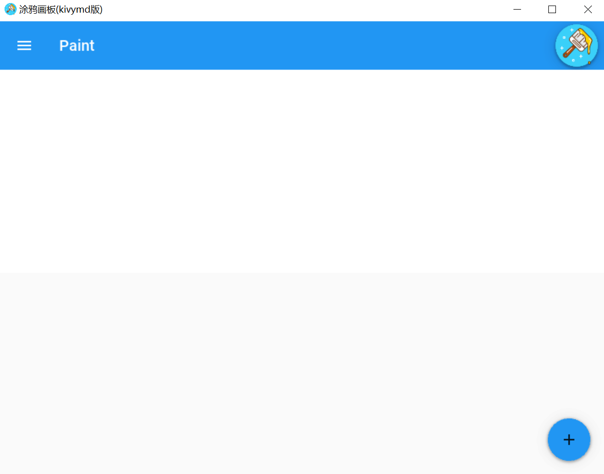
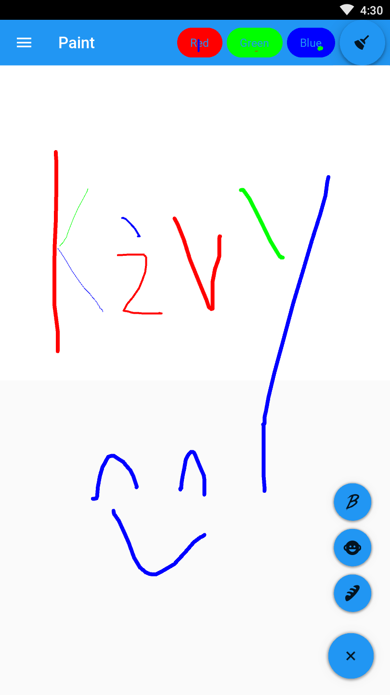

## 第三章 涂鸦画板项目基于kivymd实现

------

### 1.项目展示与画板整体界面

我们进一步对涂鸦画板在界面层面上做优化，我们使用kivymd库进行界面的优化，kivymd是与Material Desugn兼容的小部件的集合，可与kivy一起使用，kivymd的目标是在不牺牲易用性或应用程序性能的前提下，尽可能接近Google的Material Design规范。kivymd的原作者三年前停止更新项目，<https://github.com/HeaTTheatR/KivyMD>对kivymd进行进一步的开发，目前该项目仍然处于测试版的阶段。

首先我们使用kivymd构建界面，创建`main.py`

```python

from kivy.lang import Builder
from kivy.graphics import Line, Color
from kivy.uix.widget import Widget
from kivy.uix.boxlayout import BoxLayout
from kivy.properties import StringProperty

from kivymd.app import MDApp
from kivymd.theming import ThemableBehavior


global line_width
line_width = 2

# 这个类主要copy我们在上一章中构建的类
class DrawCanvasWidget(Widget):
    def __init__(self,**kwargs):
        super().__init__(**kwargs)
        # 默认划线的颜色
        self.line_color = [0,0,0,1]
        self.canvas.add(Color(rgba=[0,0,0,1]))

    def on_touch_down(self,touch):

        if Widget.on_touch_down(self,touch):
            return
        with self.canvas:
            touch.ud['current_line'] = Line(points=(touch.x,touch.y),width=line_width)

    def on_touch_move(self,touch):
        if 'current_line' in touch.ud:
            touch.ud['current_line'].points += (touch.x,touch.y)


    def change_color(self,new_color):
        # global line_color
        self.line_color = new_color  # 在清除画板时使用
        self.canvas.add(Color(rgb=self.line_color))

    def change_line_width(self,line_width_ico="baby-face"):
        global line_width
        line_width = {"babel":1,"baby-face":2,"baguette":4}[line_width_ico]

    def clean_canvas(self):
        saved = self.children[:]  # 保留root控件上的子控件（button)
        self.clear_widgets()  # 清除所有控件间
        self.canvas.clear()   # 清除canvas
        for widget in saved:  # 将清除的子控件再画上
            self.add_widget(widget)

        self.change_color(self.line_color)


class PaintsApp(MDApp):

    def build(self):
        self.icon = "./icon.ico"
        self.title = "涂鸦画板(kivymd版)"
        self.theme_cls.primary_palette = "Blue" 

        return Builder.load_file("./paint.kv")


if __name__ == "__main__":
    PaintsApp().run()

```

创建`paint.kv`的UI界面

```
# paint in kivymd by xu jing.
# date 2020-07-09

BoxLayout:
    orientation: 'vertical'

    # toolbar
    MDToolbar:
        title: 'Paint'
        elevation: 10
        left_action_items: [['menu', lambda x: None]]
        spacing: 10
        padding: 10

    # paint canvas
    DrawCanvasWidget:
        id: my_paint
        canvas.before:
            Color:
                rgba: [1,1,1,1]
            Rectangle:
                pos: self.pos
                size: self.size

```

<div align=center>
 
</div>


### 2.改变线宽MDFloatingActionButtonSpeedDial的实现

通过kivymd中的MDFloatingActionButtonSpeedDial实现线宽的改变，修改`main.py`

```python

from kivy.lang import Builder
from kivy.graphics import Line, Color
from kivy.uix.widget import Widget
from kivy.uix.boxlayout import BoxLayout
from kivy.properties import StringProperty

from kivymd.app import MDApp
from kivymd.theming import ThemableBehavior


global line_width
line_width = 2

# 这个类主要copy我们在上一章中构建的类
class DrawCanvasWidget(Widget):
    def __init__(self,**kwargs):
        super().__init__(**kwargs)
        # 默认划线的颜色
        self.line_color = [0,0,0,1]
        self.canvas.add(Color(rgba=[0,0,0,1]))

    def on_touch_down(self,touch):

        if Widget.on_touch_down(self,touch):
            return
        with self.canvas:
            touch.ud['current_line'] = Line(points=(touch.x,touch.y),width=line_width)

    def on_touch_move(self,touch):
        if 'current_line' in touch.ud:
            touch.ud['current_line'].points += (touch.x,touch.y)


    def change_color(self,new_color):
        # global line_color
        self.line_color = new_color  # 在清除画板时使用
        self.canvas.add(Color(rgb=self.line_color))

    def change_line_width(self,line_width_ico="baby-face"):
        global line_width
        line_width = {"babel":1,"baby-face":2,"baguette":4}[line_width_ico]

    def clean_canvas(self):
        saved = self.children[:]  # 保留root控件上的子控件（button)
        self.clear_widgets()  # 清除所有控件间
        self.canvas.clear()   # 清除canvas
        for widget in saved:  # 将清除的子控件再画上
            self.add_widget(widget)

        self.change_color(self.line_color)


class PaintsApp(MDApp):
    # 修改线宽的功能
    data = {
        "babel": "Thin",
        "baby-face": "Normal",
        "baguette": "Thick",
    }

    def callback(self, instance):
        # print(instance.icon)
        if instance.icon in ["babel","baby-face","baguette"]:
            DrawCanvasWidget().change_line_width(line_width_ico=instance.icon)
            # print(line_width)


    def build(self):
        self.icon = "./icon.ico"
        self.title = "涂鸦画板(kivymd版)"
        self.theme_cls.primary_palette = "Blue" 

        return Builder.load_file("./paint.kv")


if __name__ == "__main__":
    PaintsApp().run()
```

`paint.kv`增加修改线宽的功能

```
# paint in kivymd by xu jing.
# date 2020-07-09

BoxLayout:
    orientation: 'vertical'

    # toolbar
    MDToolbar:
        title: 'Paint'
        elevation: 10
        left_action_items: [['menu', lambda x: None]]
        spacing: 10
        padding: 10

    # paint canvas
    DrawCanvasWidget:
        id: my_paint
        canvas.before:
            Color:
                rgba: [1,1,1,1]
            Rectangle:
                pos: self.pos
                size: self.size


    # line width
    MDFloatingActionButtonSpeedDial:
        data: app.data
        hint_animation: True
        rotation_root_button: True
        callback: app.callback

```

<div align=center>
 
</div>


### 3.清除功能MDFloatingActionButton的实现

增加清除canvas的功能，在界面设计时，我们已经在上一章中实现了清除的事件，仅仅在`paint.kv`中实现清除的控件即可

```
# paint in kivymd by xu jing.
# date 2020-07-09

BoxLayout:
    orientation: 'vertical'

    # toolbar
    MDToolbar:
        title: 'Paint'
        elevation: 10
        left_action_items: [['menu', lambda x: None]]
        spacing: 10
        padding: 10

        # clean canvas
        MDFloatingActionButton:
            icon: "./icon.ico"
            opposite_colors: True
            elevation_normal: 8
            md_bg_color: app.theme_cls.primary_color
            pos_hint: {"center_x": .5,"center_y": .5}
            on_release: root.ids.my_paint.clean_canvas()


    # paint canvas
    DrawCanvasWidget:
        id: my_paint
        canvas.before:
            Color:
                rgba: [1,1,1,1]
            Rectangle:
                pos: self.pos
                size: self.size

    # line width
    MDFloatingActionButtonSpeedDial:
        data: app.data
        hint_animation: True
        rotation_root_button: True
        callback: app.callback


```


<div align=center>
 
</div>


### 4.改变颜色MDRoundFlatButton的实现

增加canvas线条颜色的功能，在界面设计时，我们已经在上一章中实现了更改颜色的事件，仅仅在`paint.kv`中实现更改颜色的控件即可

```

# paint in kivymd by xu jing.
# date 2020-07-09

BoxLayout:
    orientation: 'vertical'

    # toolbar
    MDToolbar:
        title: 'Paint'
        elevation: 10
        left_action_items: [['menu', lambda x: None]]
        spacing: 10
        padding: 10

        # line color
        MDRoundFlatButton:
            text: "Red"
            elevation_normal: 2
            opposite_colors: True
            md_bg_color: [1,0,0,1]
            pos_hint: {"center_x": .5,"center_y": .5}
            on_release: root.ids.my_paint.change_color(self.md_bg_color)

        MDRoundFlatButton:
            text: "Green"
            elevation_normal: 2
            opposite_colors: True
            md_bg_color: [0,1,0,1]
            pos_hint: {"center_x": .5,"center_y": .5}
            on_release: root.ids.my_paint.change_color(self.md_bg_color)

        MDRoundFlatButton:
            text: "Blue"
            elevation_normal: 2
            opposite_colors: True
            md_bg_color: [0,0,1,1]
            pos_hint: {"center_x": .5,"center_y": .5}
            on_release: root.ids.my_paint.change_color(self.md_bg_color)

        # clean canvas
        MDFloatingActionButton:
            icon: "./icon.ico"
            opposite_colors: True
            elevation_normal: 8
            md_bg_color: app.theme_cls.primary_color
            pos_hint: {"center_x": .5,"center_y": .5}
            on_release: root.ids.my_paint.clean_canvas()


    # paint canvas
    DrawCanvasWidget:
        id: my_paint
        canvas.before:
            Color:
                rgba: [1,1,1,1]
            Rectangle:
                pos: self.pos
                size: self.size

    # line width
    MDFloatingActionButtonSpeedDial:
        data: app.data
        hint_animation: True
        rotation_root_button: True
        callback: app.callback

```

<div align=center>
 
</div>


### 5.项目总结

我们使用kivymd优化了kivy的UI界面，使其看起来更像是一个安卓或ios的NUI应用，对于UI方面的设计笔者并不精通，在真正的项目开发过程中，可以寻求公司UI设计师的帮助，基于UI设计师对于控件的设计，我们使用kivy或kivymd去实现。

我们使用buildozer来打包我们的安卓应用程序，可以参考第9章的介绍，打包后的apk在安卓模拟器上的运行效果如下图所示：

安卓模拟器上的效果：

<div align=center>
 
</div>

安卓手机上的效果：

<div align=center>
 
</div>

