## 第五章 基于生成对抗网络(GAN)的一键现实转换二次元动画场景迁移项目(基于Kivymd)

------

### 1.CartoonGAN的Flask部署与测试

为了后期安卓打包的方便，我们将CartoonGAN网络通过WebAPI的方式部署，这里我们采用Flask去部署我们的CartoonGAN,创建`flask_app.py`其代码如下：

```python
# encoding: utf-8

'''
dataxujing
2020-07-04

基于CartoonGAN的现实迁移二次元动画风格的风格迁移服务

基于Flask,Pytorch


'''

import os
from io import BytesIO
import numpy as np
import time
import cv2
from PIL import Image

import base64
import json
import flask
from flask import request, Flask

import torch
import torchvision.transforms as transforms
from torch.autograd import Variable
import torchvision.utils as vutils
from network.Transformer import Transformer

app = Flask(__name__)

# load pretrained model
model = Transformer()

model_dict = {}
# [宫崎骏, 细田守, 盗梦侦探（日本动画名）, 新海诚]
for model_name in ["Hayao","Hosoda","Paprika","Shinkai"]:
    # globals()['model_'+model_name] = Transformer().load_state_dict(torch.load(os.path.join("./static/model", model_name + '_net_G_float.pth'))).eval()
    
    globals()['model_'+model_name] = Transformer()
    globals()['model_'+model_name].load_state_dict(torch.load(os.path.join("./static/model", model_name + '_net_G_float.pth')))

# 测试接口
@app.route("/test/<name>",methods=["GET","POST"])
def test(name):
    return "Test Get: {}".format(name)


# model_name example: model_Hayao
@app.route("/predict/<model_name>", methods=["GET","POST"])
def transfor_cartoon(model_name):

    try:
        #解析图片数据
        image_b64 = base64.b64decode(str(request.form['image']))
        image_data = np.fromstring(image_b64, np.uint8)
        # image_data = cv2.imdecode(image_data, cv2.IMREAD_COLOR)
        # cv2.imwrite('/root/01.png', image_data)

        input_image = Image.open(BytesIO(image_data)).convert('RGB')

        # 开始识别
        model = globals()[model_name].eval()
        device = torch.device('cuda' if torch.cuda.is_available() else 'cpu')

        # 图像处理
        h = input_image.size[0]
        w = input_image.size[1]
        ratio = h *1.0 / w
        # 将长边缩小到450
        if ratio > 1:
            h = 450
            w = int(h*1.0/ratio)
        else:
            w = 450
            h = int(w * ratio)
        input_image = input_image.resize((h, w), Image.BICUBIC)
        input_image = np.asarray(input_image)
        # RGB -> BGR
        input_image = input_image[:, :, [2, 1, 0]]
        input_image = transforms.ToTensor()(input_image).unsqueeze(0)
        # preprocess, (-1, 1)
        input_image = -1 + 2 * input_image 

        if torch.cuda.is_available():
            model.cuda()
            input_image = Variable(input_image).cuda()
        else:
            model.float()
            input_image = Variable(input_image).float()

        # forward
        output_image = model(input_image)
        output_image = output_image[0]
        # BGR -> RGB
        output_image = output_image[[2, 1, 0], :, :]
        # deprocess, (0, 1)
        output_image = output_image.data.cpu().float() * 0.5 + 0.5
        # save
        # vutils.save_image(output_image, os.path.join(opt.output_dir, files[:-4] + '_' + opt.style + '.jpg'))

        # 去掉batch size维度
        output_image = output_image.squeeze()
        # 从[0,1]转化为[0,255]，再从CHW转为HWC，最后转为cv2
        output_image = output_image.mul_(255).add_(0.5).clamp_(0, 255).permute(1, 2, 0).type(torch.uint8).numpy()
        # RGB转BRG
        output_image_cv2 = cv2.cvtColor(output_image, cv2.COLOR_RGB2BGR)

        # opencv 转 base64
        image = cv2.imencode('.jpg', output_image_cv2)[1]
        base64_data = str(base64.b64encode(image))[2:-1]

        res = {"pred":base64_data,"code":"200"}
 
    except Exception as e:
        print(str(e))
        res = {'pred': "we loss", 'code': "404"}
    
    return json.dumps(res)
 
 
if __name__ == "__main__":
    app.run(debug=True,host="0.0.0.0",port=8080)

```

测试我们的Flask WebAPI,创建`client_test.py`


```python

'''
dataxujing
2020-07-04

请求Flask CartoonGAN服务的测试代码
用来验证Web服务的正常
'''


import requests
import base64
import json
from PIL import Image
import cv2
import numpy as np

#将图片数据转成base64格式
with open('./static/test_image/test.jpg', 'rb') as f:
    img = base64.b64encode(f.read()).decode()
image = []
image.append(img)
res = {"image":image}

#访问服务
# model: "model_Hayao"(宫崎骏),"model_Hosoda","model_Paprika","model_Shinkai"
url = "http://10.10.15.106:8080/predict/model_Hayao"
headers = {'user-agent':'Mozilla/5.0 (Windows NT 10.0; Win64; x64) AppleWebKit/537.36 (KHTML, like Gecko) Chrome/74.0.3729.131 Safari/537.36'}
res_back = requests.post(url,data=res,headers=headers, timeout=200)


# save cartoon image
state = json.loads(res_back.text).get('code')
if state == "404":
    print("we loss")
else:
    img_bs64 = json.loads(res_back.text).get('pred')

    imgString = base64.b64decode(img_bs64.encode("ascii"))
    nparr = np.fromstring(imgString,np.uint8)  
    image = cv2.imdecode(nparr,cv2.IMREAD_COLOR)

    cv2.imwrite("test_res.jpg",image)

```

测试结果如下图：

原图：

<div align=center>
 
</div>
<br>


风格转化后的Cartoon:

<div align=center>
 
</div>
<br>

### 2.kivymd定义主界面

首先创建`main.py`

```python


'''
xujing
2020-06-30

基于kivymd和pytorch的二次元风格转换app

'''

from kivy.core.window import Window
from kivy.lang import Builder
from kivy.uix.boxlayout import BoxLayout
from kivy.uix.image import Image
from kivy.properties import ObjectProperty

from kivymd.app import MDApp
from kivymd.uix.dialog import MDDialog
from kivymd.uix.button import MDFlatButton
from kivymd.uix.picker import MDDatePicker
from kivymd.uix.menu import MDDropdownMenu, RightContent

from kivymd.toast import toast
from kivymd.uix.bottomsheet import MDGridBottomSheet

from kivymd.uix.filemanager import MDFileManager
from kivy.graphics.texture import Texture

import requests
import base64
import json
import cv2
import numpy as np
import time
import os
import logging


class MyToolBar(BoxLayout):

    def __init__(self,**kwargs):
        super().__init__(**kwargs)
        

class CartoonApp(MDApp):
    

    def build(self):
        self.icon="./static/icon.png"
        self.title="基于GAN的二次元风格转换App"
        self.theme_cls.primary_palette = "Purple"

        mytoolbar = Builder.load_file("./mytoolbar.kv")


        return mytoolbar


if __name__ == "__main__":

    CartoonApp().run()


```

创建 `mytoolbar.kv`的整体UI界面

```
#: import C kivy.utils.get_hex_from_color

MyToolBar:
    BoxLayout:
        orientation:'vertical'

        MDToolbar:
            title: 'CartoonGAN' 
            md_bg_color: 0.12, 0.56, 1, 1
            specific_text_color: app.theme_cls.accent_color
            icon:"image-search-outline"
            left_action_items: [["menu", lambda x: None]]
            right_action_items: [["dots-vertical", lambda x: None],["clock", lambda x:None]]

   
        MDBottomNavigation:
            panel_color: 0.12, 0.56, 1, 1
            MDBottomNavigationItem:
                name: 'screen 1'
                text: 'Home'
                icon: 'home'

                canvas:
                    Color:
                        rgba: [1,1,1,1]
                    Rectangle:
                        size: root.size
                        pos: root.pos
                        source: "./static/index.png"

            MDBottomNavigationItem:
                name: 'screen 2'
                text: 'UploadImage'
                icon: 'cloud-upload'
                font_name: './static/DroidSansFallback.ttf'


            MDBottomNavigationItem:
                name: 'screen 3'
                text: 'Download'
                icon: 'folder-download'

```

运行后的整体界面效果为:

<div align=center>
 
</div>
<br>


### 3.Home界面的实现

修改`mytoolbar.kv` 增加Label

```
#: import C kivy.utils.get_hex_from_color

MyToolBar:
    BoxLayout:
        orientation:'vertical'

        MDToolbar:
            title: 'CartoonGAN' 
            md_bg_color: 0.12, 0.56, 1, 1
            specific_text_color: app.theme_cls.accent_color
            icon:"image-search-outline"
            left_action_items: [["menu", lambda x: None]]
            right_action_items: [["dots-vertical", lambda x: None],["clock", lambda x:None]]

   
        MDBottomNavigation:
            panel_color: 0.12, 0.56, 1, 1

            # Page Index
            MDBottomNavigationItem:
                name: 'screen 1'
                text: 'Home'
                icon: 'home'

                canvas:
                    Color:
                        rgba: [1,1,1,1]
                    Rectangle:
                        size: root.size
                        pos: root.pos
                        source: "./static/index.png"

                MDLabel:
                    text: '[ref="click"][b]\u57fa\u4e8eGAN\u7684\u4e8c\u6b21\u5143\u98ce\u683c\u8f6c\u6362App[/b][/ref]'
                    font_name: './static/DroidSansFallback.ttf'
                    font_size: 30
                    pos_hint: {"center_x":0.5,"y":0.2}
                    markup: True
                    halign: "center"
                    theme_text_color: "Custom"
                    text_color: 1, 1, 0, 1


                MDLabel:
                    text: '[b]v1.0.0[/b]'
             
                    font_name: './static/DroidSansFallback.ttf'
                    font_size: 20
                    pos_hint: {"center_x":0.5,"y":0.1}
                    markup: True
                    halign: "center"
                    theme_text_color: "Custom"
                    text_color: 1, 1, 0, 1

                MDLabel:
                    text: '[b]\u5f00\u53d1\u8005\uff1a\u0020\u5f90\u9759[/b]'
                    font_name: './static/DroidSansFallback.ttf'
                    font_size: 20
                    pos_hint: {"center_x":0.5,"y":0.05}
                    markup: True
                    halign: "center"
                    theme_text_color: "Custom"
                    text_color: 1, 1, 0, 1

            # Page UpLoad

            MDBottomNavigationItem:
                name: 'screen 2'
                text: 'UploadImage'
                icon: 'cloud-upload'
                font_name: './static/DroidSansFallback.ttf'


            # Page DownLoad

            MDBottomNavigationItem:
                name: 'screen 3'
                text: 'Download'
                icon: 'folder-download'

```

<div align=center>
 
</div>
<br>


### 4.UPLOADIMAGE功能的实现

UPLOADIMAGE页面是我们基于生成对抗网络(GAN)的一键现实转换二次元动画场景迁移项目的核心功能，主要包括：

+ 一个功能说明弹窗，弹窗显示了我们项目最核心的生成对抗网络(GAN)的Paper和资源
+ 一个弹窗Button，主要用于选择不同的风格转化，目前支持： 宫崎骏, 细田守, 盗梦侦探（日本动画名）, 新海诚的动画风格转化,同时实现一个日历显示的弹窗功能
+ 一个文件上传功能，主要实现在手机文件中上传选中的图像交给我们的Flask识别服务识别进行风格转化，转化过程中，Flask服务会接收到上传的图片和弹窗Button选择的转换类型，后台调用不同GAN模型进行识别
+ 显示风格转化后的图像， 该功能主要接收将转换后的图像并显示在界面

下面我们将在本节一一实现上述功能。

+ 首先我们实现弹窗功能，我们在ToolBar的标题栏实现弹窗，首先我们修改`mytoolbar.kv`增加控件的事件函数:

```
#: import C kivy.utils.get_hex_from_color

MyToolBar:
    BoxLayout:
        orientation:'vertical'

        MDToolbar:
            title: 'CartoonGAN' 
            md_bg_color: 0.12, 0.56, 1, 1
            specific_text_color: app.theme_cls.accent_color
            icon:"image-search-outline"
            left_action_items: [["menu", lambda x: root.show_info_dialog()]]  #<----------------------None
            right_action_items: [["dots-vertical", lambda x: None],["clock", lambda x:None]]

   
        MDBottomNavigation:
            panel_color: 0.12, 0.56, 1, 1

            # Page Index
            MDBottomNavigationItem:
                name: 'screen 1'
                text: 'Home'
                icon: 'home'

                canvas:
                    Color:
                        rgba: [1,1,1,1]
                    Rectangle:
                        size: root.size
                        pos: root.pos
                        source: "./static/index.png"

                MDLabel:
                    text: '[ref="click"][b]\u57fa\u4e8eGAN\u7684\u4e8c\u6b21\u5143\u98ce\u683c\u8f6c\u6362App[/b][/ref]'
                    font_name: './static/DroidSansFallback.ttf'
                    font_size: 30
                    pos_hint: {"center_x":0.5,"y":0.2}
                    markup: True
                    halign: "center"
                    theme_text_color: "Custom"
                    text_color: 1, 1, 0, 1


                MDLabel:
                    text: '[b]v1.0.0[/b]'
             
                    font_name: './static/DroidSansFallback.ttf'
                    font_size: 20
                    pos_hint: {"center_x":0.5,"y":0.1}
                    markup: True
                    halign: "center"
                    theme_text_color: "Custom"
                    text_color: 1, 1, 0, 1

                MDLabel:
                    text: '[b]\u5f00\u53d1\u8005\uff1a\u0020\u5f90\u9759[/b]'
                    font_name: './static/DroidSansFallback.ttf'
                    font_size: 20
                    pos_hint: {"center_x":0.5,"y":0.05}
                    markup: True
                    halign: "center"
                    theme_text_color: "Custom"
                    text_color: 1, 1, 0, 1

            # Page UpLoad

            MDBottomNavigationItem:
                name: 'screen 2'
                text: 'UploadImage'
                icon: 'cloud-upload'
                font_name: './static/DroidSansFallback.ttf'


            # Page DownLoad

            MDBottomNavigationItem:
                name: 'screen 3'
                text: 'Download'
                icon: 'folder-download'

                
```

我们在`main.py`中定义`show_info_dialog()`方法

```python
'''
xujing
2020-06-30

基于kivymd和pytorch的二次元风格转换app

'''

from kivy.core.window import Window
from kivy.lang import Builder
from kivy.uix.boxlayout import BoxLayout
from kivy.uix.image import Image
from kivy.properties import ObjectProperty

from kivymd.app import MDApp
from kivymd.uix.dialog import MDDialog
from kivymd.uix.button import MDFlatButton
from kivymd.uix.picker import MDDatePicker
from kivymd.uix.menu import MDDropdownMenu, RightContent

from kivymd.toast import toast
from kivymd.uix.bottomsheet import MDGridBottomSheet

from kivymd.uix.filemanager import MDFileManager
from kivy.graphics.texture import Texture

import requests
import base64
import json
import cv2
import numpy as np
import time
import os
import logging


class MyToolBar(BoxLayout):


    def __init__(self,**kwargs):
        super().__init__(**kwargs)
        self.dialog = None  # 定义弹窗全局对象

    # 在这里实例化了MDDialog类
    def show_alert_dialog(self):
        if not self.dialog:
            self.dialog = MDDialog(
                title="CartoonGAN",
                text='''1.Paper:https://openaccess.thecvf.com/content_cvpr_2018/CameraReady/2205.pdf\n 2.GitHub:https://github.com/Yijunmaverick/CartoonGAN-Test-Pytorch-Torch\n3.Repo:https://github.com/znxlwm/pytorch-CartoonGAN''',
                # buttons=[
                #     MDFlatButton(
                #         text="取消",font_name="./static/DroidSansFallback.ttf"
                #     )],
                radius=[20, 7, 20, 7],
                type="custom",
            )
        self.dialog.open()


    # 事件函数，调用会打开弹窗
    # 这里我们不需要定义关闭close()的方法，因为在触摸或点击非弹窗部分会自动关闭弹窗
    def show_info_dialog(self):
        self.show_alert_dialog()


class CartoonApp(MDApp):
    

    def build(self):
        self.icon="./static/icon.png"
        self.title="基于GAN的二次元风格转换App"
        self.theme_cls.primary_palette = "Purple"

        mytoolbar = Builder.load_file("./mytoolbar.kv")


        return mytoolbar


if __name__ == "__main__":

    CartoonApp().run()

```

弹窗的运行效果展示：

<div align=center>
 
</div>
<br>

需要注意的是目前kivymd的该弹窗功能不支持中文内容展示，那么我们可以通过修改底层代码的方式使其支持中文显示。


+ MDGridBottomSheet()弹窗Button的实现及日历弹窗的实现

该功能的实现仍然在ToolBar上进行，首先我们修改`mytoolbar.kv`添加事件函数的调用

```

#: import C kivy.utils.get_hex_from_color

MyToolBar:
    BoxLayout:
        orientation:'vertical'

        MDToolbar:
            title: 'CartoonGAN' 
            md_bg_color: 0.12, 0.56, 1, 1
            specific_text_color: app.theme_cls.accent_color
            icon:"image-search-outline"
            left_action_items: [["menu", lambda x: root.show_info_dialog()]]  #<----------------------None
            right_action_items: [["dots-vertical", lambda x: root.show_grid_bottom_sheet()],["clock", lambda x: root.show_example_date_picker()]]     #<------------------------------------None

   
        MDBottomNavigation:
            panel_color: 0.12, 0.56, 1, 1

            # Page Index
            MDBottomNavigationItem:
                name: 'screen 1'
                text: 'Home'
                icon: 'home'

                canvas:
                    Color:
                        rgba: [1,1,1,1]
                    Rectangle:
                        size: root.size
                        pos: root.pos
                        source: "./static/index.png"

                MDLabel:
                    text: '[ref="click"][b]\u57fa\u4e8eGAN\u7684\u4e8c\u6b21\u5143\u98ce\u683c\u8f6c\u6362App[/b][/ref]'
                    font_name: './static/DroidSansFallback.ttf'
                    font_size: 30
                    pos_hint: {"center_x":0.5,"y":0.2}
                    markup: True
                    halign: "center"
                    theme_text_color: "Custom"
                    text_color: 1, 1, 0, 1


                MDLabel:
                    text: '[b]v1.0.0[/b]'
             
                    font_name: './static/DroidSansFallback.ttf'
                    font_size: 20
                    pos_hint: {"center_x":0.5,"y":0.1}
                    markup: True
                    halign: "center"
                    theme_text_color: "Custom"
                    text_color: 1, 1, 0, 1

                MDLabel:
                    text: '[b]\u5f00\u53d1\u8005\uff1a\u0020\u5f90\u9759[/b]'
                    font_name: './static/DroidSansFallback.ttf'
                    font_size: 20
                    pos_hint: {"center_x":0.5,"y":0.05}
                    markup: True
                    halign: "center"
                    theme_text_color: "Custom"
                    text_color: 1, 1, 0, 1

            # Page UpLoad

            MDBottomNavigationItem:
                name: 'screen 2'
                text: 'UploadImage'
                icon: 'cloud-upload'
                font_name: './static/DroidSansFallback.ttf'


            # Page DownLoad

            MDBottomNavigationItem:
                name: 'screen 3'
                text: 'Download'
                icon: 'folder-download'

```

我们在`main.py`中实现`how_grid_bottom_sheet()`和`show_example_date_picker()`方法

```python


'''
xujing
2020-06-30

基于kivymd和pytorch的二次元风格转换app

'''

from kivy.core.window import Window
from kivy.lang import Builder
from kivy.uix.boxlayout import BoxLayout
from kivy.uix.image import Image
from kivy.properties import ObjectProperty

from kivymd.app import MDApp
from kivymd.uix.dialog import MDDialog
from kivymd.uix.button import MDFlatButton
from kivymd.uix.picker import MDDatePicker
from kivymd.uix.menu import MDDropdownMenu, RightContent

from kivymd.toast import toast
from kivymd.uix.bottomsheet import MDGridBottomSheet

from kivymd.uix.filemanager import MDFileManager
from kivy.graphics.texture import Texture

import requests
import base64
import json
import cv2
import numpy as np
import time
import os
import logging


class MyToolBar(BoxLayout):
    previous_date = ObjectProperty()  # 控件添加 对象属性（日历对象）

    def __init__(self,**kwargs):
        super().__init__(**kwargs)
        self.dialog = None
        self.cartoon_class = "model_Hayao"  # 默认调用宫崎骏的画风


    def show_alert_dialog(self):
        if not self.dialog:
            self.dialog = MDDialog(
                title="CartoonGAN",
                text='''1.Paper:https://openaccess.thecvf.com/content_cvpr_2018/CameraReady/2205.pdf\n 2.GitHub:https://github.com/Yijunmaverick/CartoonGAN-Test-Pytorch-Torch\n3.Repo:https://github.com/znxlwm/pytorch-CartoonGAN''',
                # buttons=[
                #     MDFlatButton(
                #         text="取消",font_name="./static/DroidSansFallback.ttf"
                #     )],
                radius=[20, 7, 20, 7],
                type="custom",
            )
        self.dialog.open()

    def show_info_dialog(self):
        self.show_alert_dialog()

    # 显示日历调用MDDatePicker(),事件函数
    def show_example_date_picker(self, *args):

        pd_ = self.previous_date
        try:
            MDDatePicker(self.set_previous_date,
                         pd_.year, pd_.month, pd_.day).open()
        except AttributeError:
            MDDatePicker(self.set_previous_date).open()


    def set_previous_date(self, date_obj):
        self.previous_date = date_obj


    # MDGridBottomSheet() 事件的实现
    # button sheet, menu 的隐藏的button,主要用于选择动画的画风
    def callback_for_menu_items(self, *args):
        toast(args[0])
        self.cartoon_class = "model_" + args[0]
        # print(self.cartoon_class)

    def show_grid_bottom_sheet(self):
        
        bottom_sheet_menu = MDGridBottomSheet()
        # "Hayao","Hosoda","Paprika","Shinkai"
        data = {
            "Hayao": "washing-machine",
            "Hosoda": "baby-carriage",
            "Paprika": "barcode-scan",
            "Shinkai": "cake",
        }
        for item in data.items():
            bottom_sheet_menu.add_item(
                item[0],
                lambda x, y=item[0]: self.callback_for_menu_items(y),
                icon_src=item[1],

            )
        bottom_sheet_menu.open()


class CartoonApp(MDApp):
    

    def build(self):
        self.icon="./static/icon.png"
        self.title="基于GAN的二次元风格转换App"
        self.theme_cls.primary_palette = "Purple"

        mytoolbar = Builder.load_file("./mytoolbar.kv")


        return mytoolbar


if __name__ == "__main__":

    CartoonApp().run()

```

实现效果如下图所示：

<div align=center>
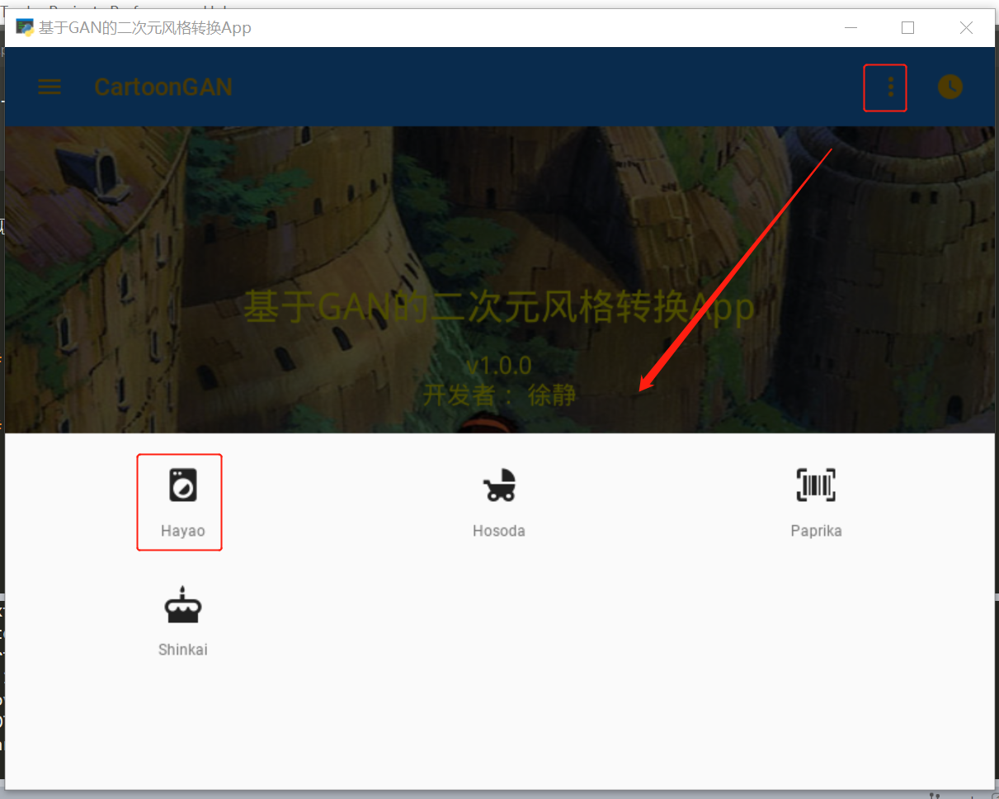 
</div>
<br>

<div align=center>
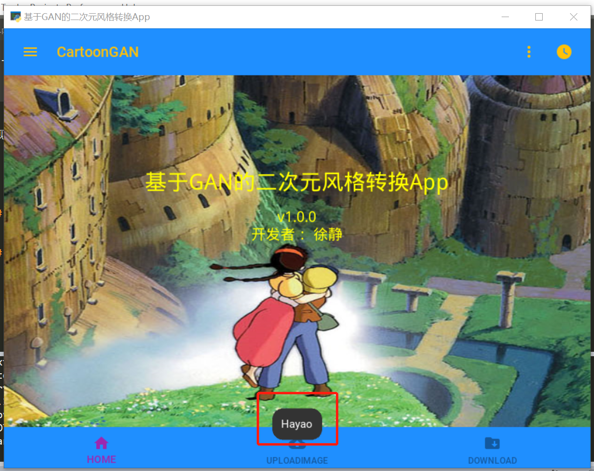 
</div>
<br>

<div align=center>
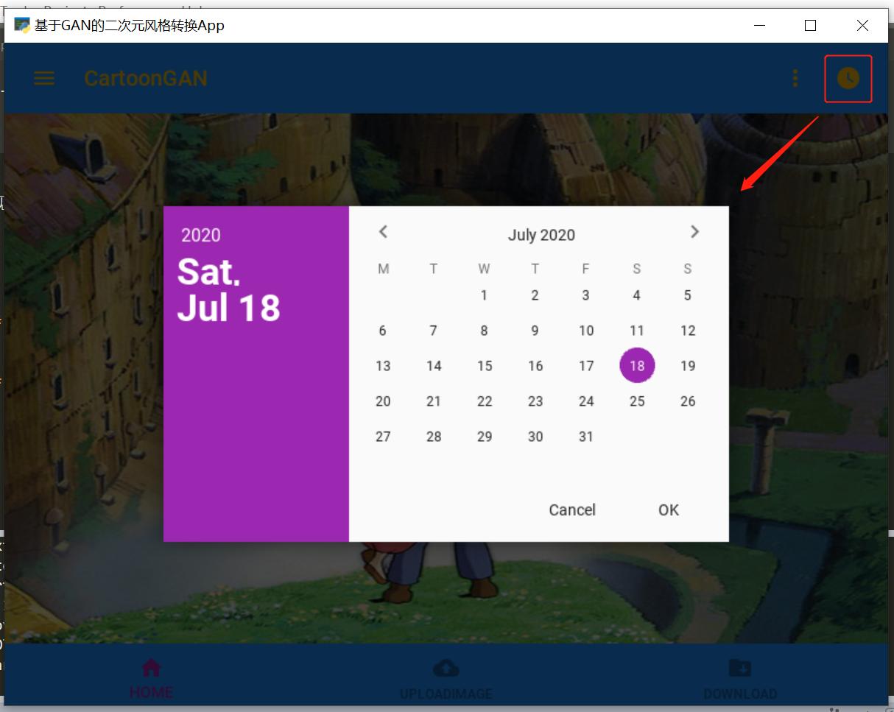 
</div>
<br>

+ 文件的上传识别功能实现识别和显示

本节我们实现通过文件管理，上传手机本地的图片到我们自己定义的Flask Web识别服务，并接收识别结果


首先我们在`main.py`中定义文件管理，实现上传和识别的功能

```python


'''
xujing
2020-06-30

基于kivymd和pytorch的二次元风格转换app

'''

from kivy.core.window import Window
from kivy.lang import Builder
from kivy.uix.boxlayout import BoxLayout
from kivy.uix.image import Image
from kivy.properties import ObjectProperty

from kivymd.app import MDApp
from kivymd.uix.dialog import MDDialog
from kivymd.uix.button import MDFlatButton
from kivymd.uix.picker import MDDatePicker
from kivymd.uix.menu import MDDropdownMenu, RightContent

from kivymd.toast import toast
from kivymd.uix.bottomsheet import MDGridBottomSheet

from kivymd.uix.filemanager import MDFileManager
from kivy.graphics.texture import Texture

import requests
import base64
import json
import cv2
import numpy as np
import time
import os
import logging


class MyToolBar(BoxLayout):
    previous_date = ObjectProperty()

    def __init__(self,**kwargs):
        super().__init__(**kwargs)
        self.dialog = None
        self.cartoon_class = "model_Hayao"


        #file manager 
        self.manager_open = False
        self.file_manager = MDFileManager(
            exit_manager=self.exit_manager,
            select_path=self.select_path,
            previous=True,
        )


    def show_alert_dialog(self):
        if not self.dialog:
            self.dialog = MDDialog(
                title="CartoonGAN",
                text='''1.Paper:https://openaccess.thecvf.com/content_cvpr_2018/CameraReady/2205.pdf\n 2.GitHub:https://github.com/Yijunmaverick/CartoonGAN-Test-Pytorch-Torch\n3.Repo:https://github.com/znxlwm/pytorch-CartoonGAN''',
                # buttons=[
                #     MDFlatButton(
                #         text="取消",font_name="./static/DroidSansFallback.ttf"
                #     )],
                radius=[20, 7, 20, 7],
                type="custom",
            )
        self.dialog.open()


    def show_example_date_picker(self, *args):

        pd_ = self.previous_date
        try:
            MDDatePicker(self.set_previous_date,
                         pd_.year, pd_.month, pd_.day).open()
        except AttributeError:
            MDDatePicker(self.set_previous_date).open()


    def set_previous_date(self, date_obj):
        self.previous_date = date_obj


    def show_info_dialog(self):
        self.show_alert_dialog()


    # button sheet, menu 的隐藏的button,主要用于选择动画的画风
    def callback_for_menu_items(self, *args):
        toast(args[0])

        self.cartoon_class = "model_" + args[0]
        # print(self.cartoon_class)

    def show_grid_bottom_sheet(self):
        
        bottom_sheet_menu = MDGridBottomSheet()
        # "Hayao","Hosoda","Paprika","Shinkai"
        data = {
            "Hayao": "washing-machine",
            "Hosoda": "baby-carriage",
            "Paprika": "barcode-scan",
            "Shinkai": "cake",
        }
        for item in data.items():
            bottom_sheet_menu.add_item(
                item[0],
                lambda x, y=item[0]: self.callback_for_menu_items(y),
                icon_src=item[1],

            )
        bottom_sheet_menu.open()


    # file manager
    def file_manager_open(self):
        # button release event
        # self.file_manager.show('/storage/emulated/0/kivy')  # Android 替换为这个
        self.file_manager.show('/')  # output manager to the screen
        self.manager_open = True

    def select_path(self, path):
        '''
        It will be called when you click on the file name
        or the catalog selection button.

        :type path: str;
        :param path: path to the selected directory or file;
        '''

        self.exit_manager()
        toast(path)
        # path 就是我们识别的图像的路径

        # 开始请求识别
        is_image_file = lambda x: any(x.endswith(extension) for extension in [".png",".jpg",".PNG",".JPG",".JPRG",".jpeg"])
        #将图片数据转成base64格式

        if is_image_file(path):
            with open(path, 'rb') as f:
                img = base64.b64encode(f.read()).decode()
            image = []
            image.append(img)
            res = {"image":image}

            try:
                #访问服务
                # model: "model_Hayao"(宫崎骏),"model_Hosoda","model_Paprika","model_Shinkai"
                url = "http://XXXXXXX/predict/{}".format( self.cartoon_class)
                # 模拟Huawei Meta20
                # http://www.fynas.com/ua
                headers = {'user-agent': "Mozilla/5.0 (Linux; U; Android 10; zh-CN; HMA-AL00 Build/HUAWEIHMA-AL00) AppleWebKit/537.36 (KHTML, like Gecko) Version/4.0 Chrome/57.0.2987.108 UCBrowser/12.7.9.1059 Mobile Safari/537.36"}
                res_back = requests.post(url,data=res,headers=headers, timeout=200)

                # save cartoon image
                state = json.loads(res_back.text).get('code')
                if state != "404":
                    img_bs64 = json.loads(res_back.text).get('pred')

                    imgString = base64.b64decode(img_bs64.encode("ascii"))
                    # nparr = np.fromstring(imgString,np.uint8)  
                    nparr = np.frombuffer(imgString,np.uint8)  
                    image = cv2.imdecode(nparr,cv2.IMREAD_COLOR)
                    self.save_image = image.copy()

                    image = cv2.cvtColor(image, cv2.COLOR_BGR2RGBA)
                    img_buf = cv2.flip(image, 0)
                    img_buf = img_buf.tostring()
                    cartoon_texture = Texture.create(size=(image.shape[1], image.shape[0]), colorfmt='rgba') # android must rgba
                    cartoon_texture.blit_buffer(img_buf, colorfmt='rgba', bufferfmt='ubyte')

                    # display image from the texture
                    self.ids.cartoongan_tops.text = ""
                    self.ids.cartoon_image.texture = cartoon_texture
            except Exception as e:
                logging.info("[Internet Error   ] {}".format(str(e)))
                self.ids.cartoongan_tops.text = ""
                self.ids.cartoongan_tops.text = "网络错误,请重新尝试..."
        else:
            self.ids.cartoongan_tops.text = ""
            self.ids.cartoongan_tops.text = "您提交的是非图像文件,请重新尝试..."


                
    def exit_manager(self, *args):
        '''
        退出File manager
        '''
        self.manager_open = False
        self.file_manager.close()


class CartoonApp(MDApp):
    

    def build(self):
        self.icon="./static/icon.png"
        self.title="基于GAN的二次元风格转换App"
        self.theme_cls.primary_palette = "Purple"

        mytoolbar = Builder.load_file("./mytoolbar.kv")


        return mytoolbar


if __name__ == "__main__":

    CartoonApp().run()

```

在`mytoolbar.kv`中实现对用的控件

```
#: import C kivy.utils.get_hex_from_color

MyToolBar:
    BoxLayout:
        orientation:'vertical'

        MDToolbar:
            title: 'CartoonGAN' 
            md_bg_color: 0.12, 0.56, 1, 1
            specific_text_color: app.theme_cls.accent_color
            icon:"image-search-outline"
            left_action_items: [["menu", lambda x: root.show_info_dialog()]]  #<----------------------None
            right_action_items: [["dots-vertical", lambda x: root.show_grid_bottom_sheet()],["clock", lambda x: root.show_example_date_picker()]]     #<------------------------------------None

   
        MDBottomNavigation:
            panel_color: 0.12, 0.56, 1, 1

            # Page Index
            MDBottomNavigationItem:
                name: 'screen 1'
                text: 'Home'
                icon: 'home'

                canvas:
                    Color:
                        rgba: [1,1,1,1]
                    Rectangle:
                        size: root.size
                        pos: root.pos
                        source: "./static/index.png"

                MDLabel:
                    text: '[ref="click"][b]\u57fa\u4e8eGAN\u7684\u4e8c\u6b21\u5143\u98ce\u683c\u8f6c\u6362App[/b][/ref]'
                    font_name: './static/DroidSansFallback.ttf'
                    font_size: 30
                    pos_hint: {"center_x":0.5,"y":0.2}
                    markup: True
                    halign: "center"
                    theme_text_color: "Custom"
                    text_color: 1, 1, 0, 1


                MDLabel:
                    text: '[b]v1.0.0[/b]'
             
                    font_name: './static/DroidSansFallback.ttf'
                    font_size: 20
                    pos_hint: {"center_x":0.5,"y":0.1}
                    markup: True
                    halign: "center"
                    theme_text_color: "Custom"
                    text_color: 1, 1, 0, 1

                MDLabel:
                    text: '[b]\u5f00\u53d1\u8005\uff1a\u0020\u5f90\u9759[/b]'
                    font_name: './static/DroidSansFallback.ttf'
                    font_size: 20
                    pos_hint: {"center_x":0.5,"y":0.05}
                    markup: True
                    halign: "center"
                    theme_text_color: "Custom"
                    text_color: 1, 1, 0, 1

            # Page UpLoad

            MDBottomNavigationItem:
                name: 'screen 2'
                text: 'UploadImage'
                icon: 'cloud-upload'
                font_name: './static/DroidSansFallback.ttf'


                MDLabel:
                    id: cartoongan_tops
                    text: '\u0043\u0061\u0072\u0074\u006f\u006f\u006e\u0047\u0041\u004e\u0028\u0043\u0056\u0050\u0052\u0032\u0030\u0031\u0038\u0029\uff0c\u5b83\u53ef\u4ee5\u7528\u771f\u5b9e\u666f\u7269\u7684\u7167\u7247\u4f5c\u4e3a\u6e90\u56fe\u7247\uff0c\u751f\u6210\u4efb\u610f\u98ce\u683c\u7684\u6f2b\u753b\u002c\u4f5c\u8005\u672a\u5f00\u6e90\u4ee3\u7801\uff0c\u53ea\u7ed9\u51fa\u4e86\u56db\u4e2a\u8bad\u7ec3\u597d\u7684\u6a21\u578b\u0028\u5bab\u5d0e\u9a8f\u002c\u0020\u7ec6\u7530\u5b88\u002c\u0020\u76d7\u68a6\u4fa6\u63a2\u002c\u0020\u65b0\u6d77\u8bda\u0029\u3002'
                    halign: 'center'
                    font_name: './static/DroidSansFallback.ttf'
                    font_size: 24

                Image:
                    id: cartoon_image
                    

                MDRectangleFlatButton:
                    text: "\u52a0\u8f7d\u56fe\u50cf\u5e76\u505a\u4e8c\u6b21\u5143\u8f6c\u6362"
                    pos_hint: {"center_x": .5}
                    size_hint: 1, 0.05
                    text_color: 0.5, 0, 0.5, 1
                    font_name: './static/DroidSansFallback.ttf'
                    on_release: root.file_manager_open()


            # Page DownLoad

            MDBottomNavigationItem:
                name: 'screen 3'
                text: 'Download'
                icon: 'folder-download'

```

运行效果如下图：

<div align=center>
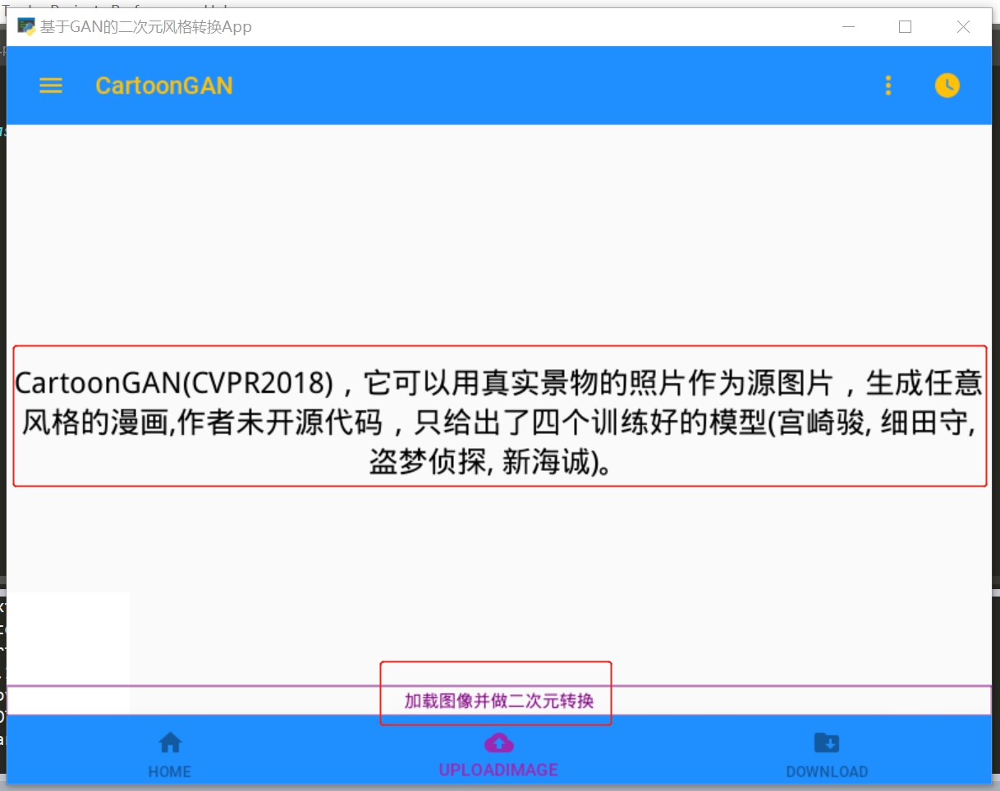 
</div>
<br>

<div align=center>
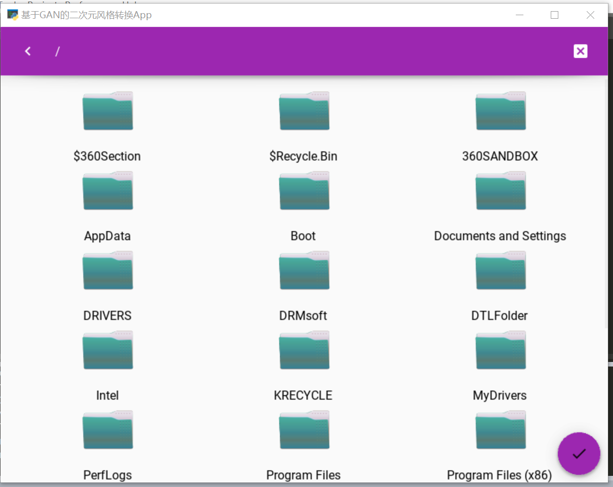 
</div>
<br>

这样我们在这一节的内容就完全实现了，下面我们在安卓模拟器上，展示一下我们实现整个识别过程的效果图：

<div align=center>
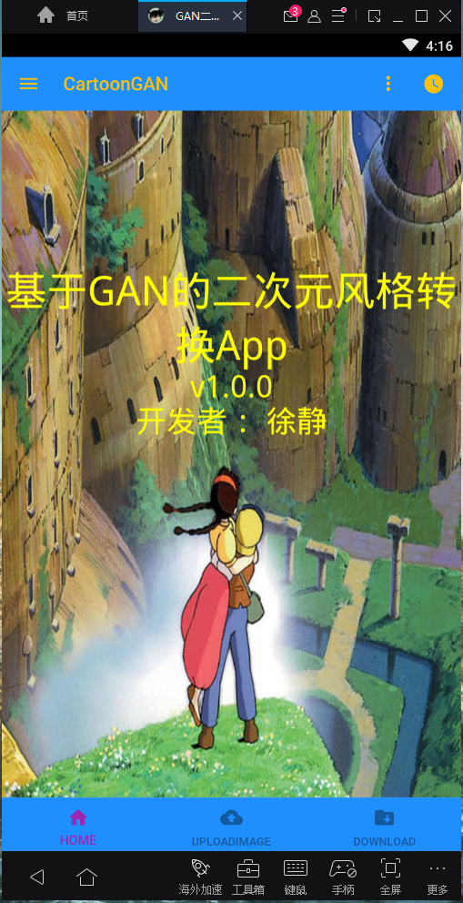 
</div>
<br>


<div align=center>
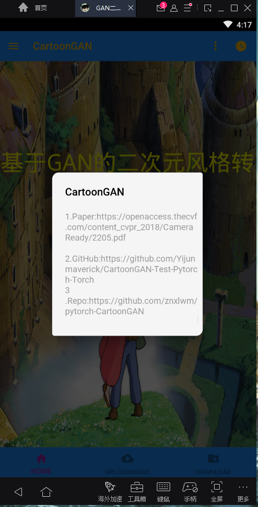 
</div>
<br>

<div align=center>
 
</div>
<br>

<div align=center>
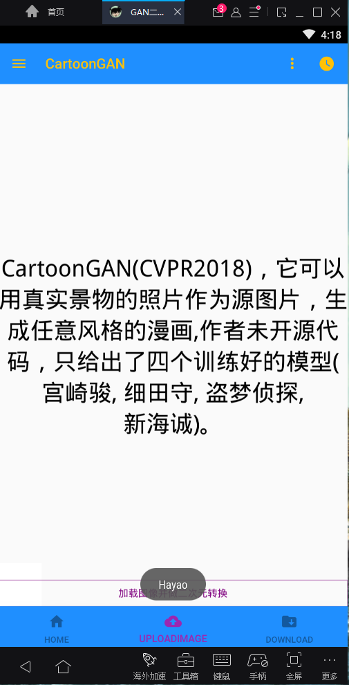 
</div>
<br>

<div align=center>
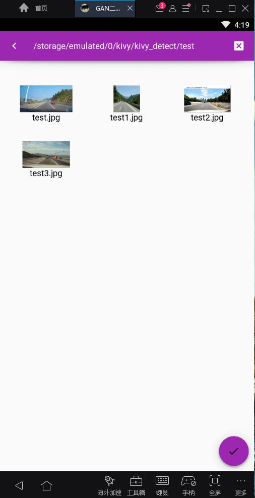 
</div>
<br>

<div align=center>
 
</div>
<br>

<div align=center>
 
</div>
<br>


### 5.DOWNLOAD功能的实现


最后我们将实现风格转换后的图片的下载和保存，该功能在DOWNLOAD页面实现，该功能同时使用了文件管理选择保存的路径，器方法和上一节中的选择文件图片识别的过程是相同的，这里我么将该部分实现的分步代码展示給大家

首先我们在`main.py`中实现文件管理的保存功能:

```python


'''
xujing
2020-06-30

基于kivymd和pytorch的二次元风格转换app

'''

from kivy.core.window import Window
from kivy.lang import Builder
from kivy.uix.boxlayout import BoxLayout
from kivy.uix.image import Image
from kivy.properties import ObjectProperty

from kivymd.app import MDApp
from kivymd.uix.dialog import MDDialog
from kivymd.uix.button import MDFlatButton
from kivymd.uix.picker import MDDatePicker
from kivymd.uix.menu import MDDropdownMenu, RightContent

from kivymd.toast import toast
from kivymd.uix.bottomsheet import MDGridBottomSheet

from kivymd.uix.filemanager import MDFileManager
from kivy.graphics.texture import Texture

import requests
import base64
import json
import cv2
import numpy as np
import time
import os
import logging


class MyToolBar(BoxLayout):
    previous_date = ObjectProperty()

    def __init__(self,**kwargs):
        super().__init__(**kwargs)
        self.dialog = None
        self.cartoon_class = "model_Hayao"

        #file manager 
        self.manager_open = False
        self.file_manager = MDFileManager(
            exit_manager=self.exit_manager,
            select_path=self.select_path,
            previous=True,
        )

        # save file manager
        self.save_manager_open = False
        self.save_file_manager = MDFileManager(
            exit_manager=self.save_exit_manager,
            select_path=self.save_select_path,
        )

        self.save_image = None


    def show_alert_dialog(self):
        if not self.dialog:
            self.dialog = MDDialog(
                title="CartoonGAN",
                text='''1.Paper:https://openaccess.thecvf.com/content_cvpr_2018/CameraReady/2205.pdf\n 2.GitHub:https://github.com/Yijunmaverick/CartoonGAN-Test-Pytorch-Torch\n3.Repo:https://github.com/znxlwm/pytorch-CartoonGAN''',
                # buttons=[
                #     MDFlatButton(
                #         text="取消",font_name="./static/DroidSansFallback.ttf"
                #     )],
                radius=[20, 7, 20, 7],
                type="custom",
            )
        self.dialog.open()


    def show_example_date_picker(self, *args):

        pd_ = self.previous_date
        try:
            MDDatePicker(self.set_previous_date,
                         pd_.year, pd_.month, pd_.day).open()
        except AttributeError:
            MDDatePicker(self.set_previous_date).open()


    def set_previous_date(self, date_obj):
        self.previous_date = date_obj


    def show_info_dialog(self):
        self.show_alert_dialog()


    # button sheet, menu 的隐藏的button,主要用于选择动画的画风
    def callback_for_menu_items(self, *args):
        toast(args[0])

        self.cartoon_class = "model_" + args[0]
        # print(self.cartoon_class)

    def show_grid_bottom_sheet(self):
        
        bottom_sheet_menu = MDGridBottomSheet()
        # "Hayao","Hosoda","Paprika","Shinkai"
        data = {
            "Hayao": "washing-machine",
            "Hosoda": "baby-carriage",
            "Paprika": "barcode-scan",
            "Shinkai": "cake",
        }
        for item in data.items():
            bottom_sheet_menu.add_item(
                item[0],
                lambda x, y=item[0]: self.callback_for_menu_items(y),
                icon_src=item[1],

            )
        bottom_sheet_menu.open()


    # file manager
    def file_manager_open(self):
        # button release event
        # self.file_manager.show('/storage/emulated/0/kivy')  # Android 替换为这个
        self.file_manager.show('/')  # output manager to the screen
        self.manager_open = True

    def select_path(self, path):
        '''
        It will be called when you click on the file name
        or the catalog selection button.

        :type path: str;
        :param path: path to the selected directory or file;
        '''

        self.exit_manager()
        toast(path)
        # path 就是我们识别的图像的路径

        # 开始请求识别
        is_image_file = lambda x: any(x.endswith(extension) for extension in [".png",".jpg",".PNG",".JPG",".JPRG",".jpeg"])
        #将图片数据转成base64格式

        if is_image_file(path):
            with open(path, 'rb') as f:
                img = base64.b64encode(f.read()).decode()
            image = []
            image.append(img)
            res = {"image":image}

            try:
                #访问服务
                # model: "model_Hayao"(宫崎骏),"model_Hosoda","model_Paprika","model_Shinkai"
                url = "http://XXXXXXXX/predict/{}".format( self.cartoon_class)
                # 模拟Huawei Meta20
                # http://www.fynas.com/ua
                headers = {'user-agent': "Mozilla/5.0 (Linux; U; Android 10; zh-CN; HMA-AL00 Build/HUAWEIHMA-AL00) AppleWebKit/537.36 (KHTML, like Gecko) Version/4.0 Chrome/57.0.2987.108 UCBrowser/12.7.9.1059 Mobile Safari/537.36"}
                res_back = requests.post(url,data=res,headers=headers, timeout=200)

                # save cartoon image
                state = json.loads(res_back.text).get('code')
                if state != "404":
                    img_bs64 = json.loads(res_back.text).get('pred')

                    imgString = base64.b64decode(img_bs64.encode("ascii"))
                    # nparr = np.fromstring(imgString,np.uint8)  
                    nparr = np.frombuffer(imgString,np.uint8)  
                    image = cv2.imdecode(nparr,cv2.IMREAD_COLOR)
                    self.save_image = image.copy()

                    image = cv2.cvtColor(image, cv2.COLOR_BGR2RGBA)
                    img_buf = cv2.flip(image, 0)
                    img_buf = img_buf.tostring()
                    cartoon_texture = Texture.create(size=(image.shape[1], image.shape[0]), colorfmt='rgba') # android must rgba
                    cartoon_texture.blit_buffer(img_buf, colorfmt='rgba', bufferfmt='ubyte')

                    # display image from the texture
                    self.ids.cartoongan_tops.text = ""
                    self.ids.cartoon_image.texture = cartoon_texture
            except Exception as e:
                logging.info("[Internet Error   ] {}".format(str(e)))
                self.ids.cartoongan_tops.text = ""
                self.ids.cartoongan_tops.text = "网络错误,请重新尝试..."
        else:
            self.ids.cartoongan_tops.text = ""
            self.ids.cartoongan_tops.text = "您提交的是非图像文件,请重新尝试..."


                
    def exit_manager(self, *args):
        '''
        退出File manager
        '''
        self.manager_open = False
        self.file_manager.close()


    # save file manager
    def save_file_manager_open(self):
        # button release event
        # self.save_file_manager.show('/storage/emulated/0/kivy/save')  # Android 替换为这个
        self.save_file_manager.show('/')  # output manager to the screen
        self.save_manager_open = True
        logging.info("[file manager save  ] save file open!")


    def save_select_path(self, path):
        '''
        It will be called when you click on the file name
        or the catalog selection button.

        :type path: str;
        :param path: path to the selected directory or file;
        '''
        logging.info("[file manager save  ] go in save path")
        self.save_exit_manager()
        logging.info("[file manager save  ] go in save path close")

        self.save_exit_manager()
        toast(path)
        
        # path 就是我们识别的图像的路径
        logging.info("[file manager save  ] go in save path")

        if (os.path.isdir(path)) and (not self.save_image is None):
            save_file_name = str(time.time())+"_"+self.cartoon_class+".jpg"
            cv2.imwrite(os.path.join(path,save_file_name),self.save_image)
            toast("Cartoon Saved: {}".format(path))
            self.ids.save_log_label.text = "二次元图片保存在：{}".format(path)
            logging.info("[file manager save  ] save success!")
        elif self.save_image is None:
            toast("No cartoon image to save!")
            self.ids.save_log_label.text = "保存失败,不存在待保存的二次元图片!"
        else:
            toast("The path to save is wrongful!")
            self.ids.save_log_label.text = "保存失败,保存路径是非法路径！"

        logging.info("[file manager save  ] save finish")

        
    def save_exit_manager(self, *args):
        '''
        退出File manager
        '''
        self.save_manager_open = False
        self.save_file_manager.close()


class CartoonApp(MDApp):
    

    def build(self):
        self.icon="./static/icon.png"
        self.title="基于GAN的二次元风格转换App"
        self.theme_cls.primary_palette = "Purple"

        mytoolbar = Builder.load_file("./mytoolbar.kv")


        return mytoolbar


if __name__ == "__main__":

    CartoonApp().run()
```

最后我们在`mytoolbar.kv`中实现保存的Butoon控件，该控件在DOWNLOAD页面实现

```

#: import C kivy.utils.get_hex_from_color

MyToolBar:
    BoxLayout:
        orientation:'vertical'

        MDToolbar:
            title: 'CartoonGAN' 
            md_bg_color: 0.12, 0.56, 1, 1
            specific_text_color: app.theme_cls.accent_color
            icon:"image-search-outline"
            left_action_items: [["menu", lambda x: root.show_info_dialog()]]  #<----------------------None
            right_action_items: [["dots-vertical", lambda x: root.show_grid_bottom_sheet()],["clock", lambda x: root.show_example_date_picker()]]     #<------------------------------------None

   
        MDBottomNavigation:
            panel_color: 0.12, 0.56, 1, 1

            # Page Index
            MDBottomNavigationItem:
                name: 'screen 1'
                text: 'Home'
                icon: 'home'

                canvas:
                    Color:
                        rgba: [1,1,1,1]
                    Rectangle:
                        size: root.size
                        pos: root.pos
                        source: "./static/index.png"

                MDLabel:
                    text: '[ref="click"][b]\u57fa\u4e8eGAN\u7684\u4e8c\u6b21\u5143\u98ce\u683c\u8f6c\u6362App[/b][/ref]'
                    font_name: './static/DroidSansFallback.ttf'
                    font_size: 30
                    pos_hint: {"center_x":0.5,"y":0.2}
                    markup: True
                    halign: "center"
                    theme_text_color: "Custom"
                    text_color: 1, 1, 0, 1


                MDLabel:
                    text: '[b]v1.0.0[/b]'
             
                    font_name: './static/DroidSansFallback.ttf'
                    font_size: 20
                    pos_hint: {"center_x":0.5,"y":0.1}
                    markup: True
                    halign: "center"
                    theme_text_color: "Custom"
                    text_color: 1, 1, 0, 1

                MDLabel:
                    text: '[b]\u5f00\u53d1\u8005\uff1a\u0020\u5f90\u9759[/b]'
                    font_name: './static/DroidSansFallback.ttf'
                    font_size: 20
                    pos_hint: {"center_x":0.5,"y":0.05}
                    markup: True
                    halign: "center"
                    theme_text_color: "Custom"
                    text_color: 1, 1, 0, 1

            # Page UpLoad

            MDBottomNavigationItem:
                name: 'screen 2'
                text: 'UploadImage'
                icon: 'cloud-upload'
                font_name: './static/DroidSansFallback.ttf'


                MDLabel:
                    id: cartoongan_tops
                    text: '\u0043\u0061\u0072\u0074\u006f\u006f\u006e\u0047\u0041\u004e\u0028\u0043\u0056\u0050\u0052\u0032\u0030\u0031\u0038\u0029\uff0c\u5b83\u53ef\u4ee5\u7528\u771f\u5b9e\u666f\u7269\u7684\u7167\u7247\u4f5c\u4e3a\u6e90\u56fe\u7247\uff0c\u751f\u6210\u4efb\u610f\u98ce\u683c\u7684\u6f2b\u753b\u002c\u4f5c\u8005\u672a\u5f00\u6e90\u4ee3\u7801\uff0c\u53ea\u7ed9\u51fa\u4e86\u56db\u4e2a\u8bad\u7ec3\u597d\u7684\u6a21\u578b\u0028\u5bab\u5d0e\u9a8f\u002c\u0020\u7ec6\u7530\u5b88\u002c\u0020\u76d7\u68a6\u4fa6\u63a2\u002c\u0020\u65b0\u6d77\u8bda\u0029\u3002'
                    halign: 'center'
                    font_name: './static/DroidSansFallback.ttf'
                    font_size: 24

                Image:
                    id: cartoon_image
                    

                MDRectangleFlatButton:
                    text: "\u52a0\u8f7d\u56fe\u50cf\u5e76\u505a\u4e8c\u6b21\u5143\u8f6c\u6362"
                    pos_hint: {"center_x": .5}
                    size_hint: 1, 0.05
                    text_color: 0.5, 0, 0.5, 1
                    font_name: './static/DroidSansFallback.ttf'
                    on_release: root.file_manager_open()


            # Page DownLoad

            MDBottomNavigationItem:
                name: 'screen 3'
                text: 'Download'
                icon: 'folder-download'


                MDLabel:
                    id: save_log_label
                    text: '\u4fdd\u5b58\u98ce\u683c\u8fc1\u79fb\u540e\u7684\u4e8c\u6b21\u5143\u56fe\u7247'
                    halign: 'center'
                    font_name: './static/DroidSansFallback.ttf'

                MDRoundFlatIconButton:
                    text: "Open manager"
                    icon: "folder"
                    pos_hint: {'center_x': .5, 'center_y': .6}
                    on_release: root.save_file_manager_open()
```

其效果为：


<div align=center>
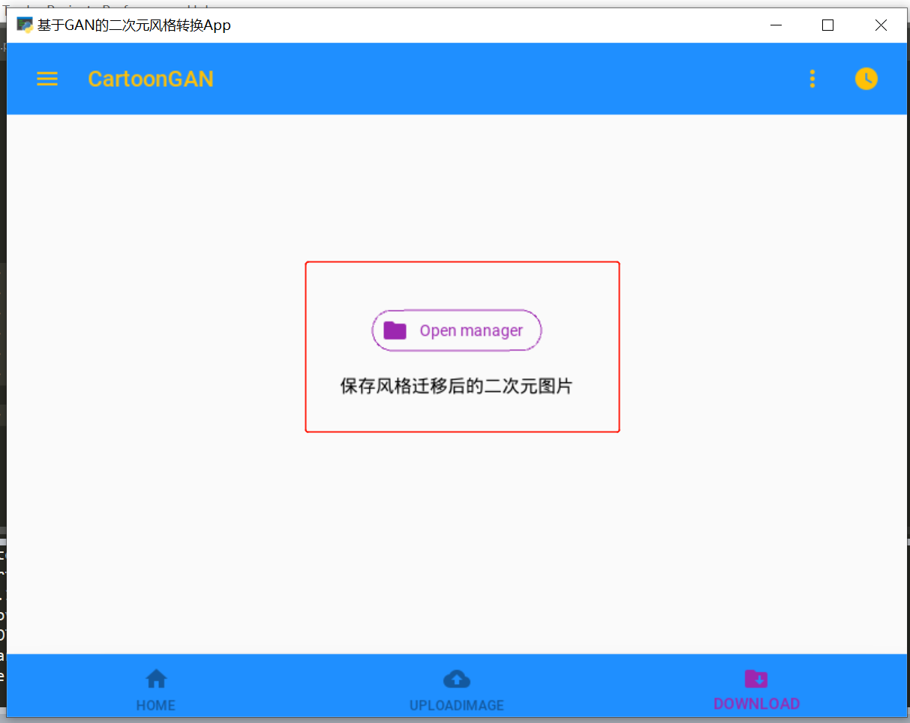 
</div>
<br>


<div align=center>
 
</div>
<br>

<div align=center>
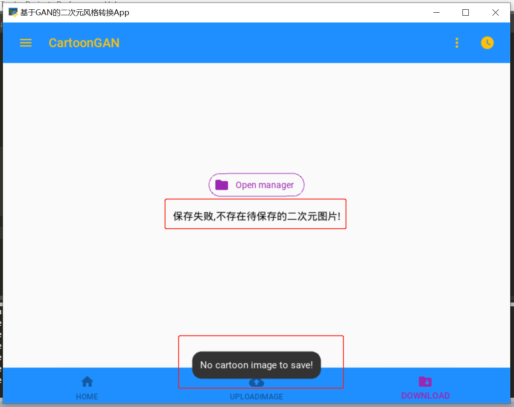 
</div>
<br>


### 6.项目总结

关于该项目的安卓打包，我们可以在第9章中给出详细的打包步骤，我们推荐使用buildozer对该项目进行安卓打包。关于打包环境的搭建可以参考buildozer官网，或读者有需要我们可以提供完整的打包环境的虚拟机镜像。本节中我们会在安卓虚拟机和真实的安卓手机上展示打包好的基于生成对抗网络(GAN)的一键现实转换二次元动画场景迁移App。


+ 安卓虚拟机


<div align=center>
 
</div>
<br>


<div align=center>
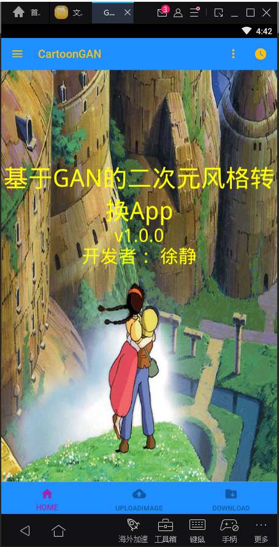 
</div>
<br>

<div align=center>
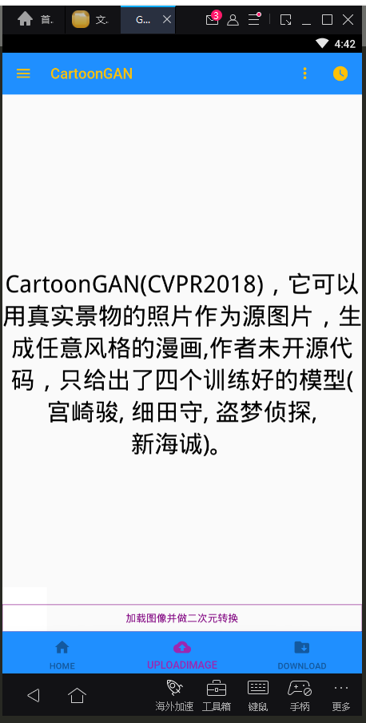 
</div>
<br>

<div align=center>
 
</div>
<br>

<div align=center>
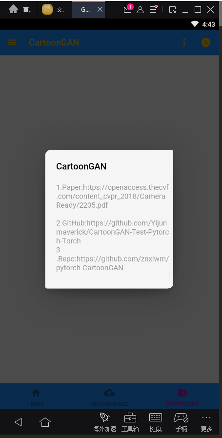 
</div>
<br>

<div align=center>
 
</div>
<br>

<div align=center>
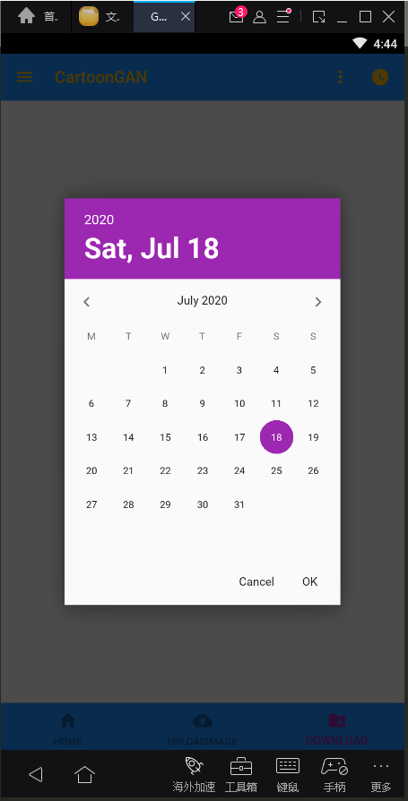 
</div>
<br>

<div align=center>
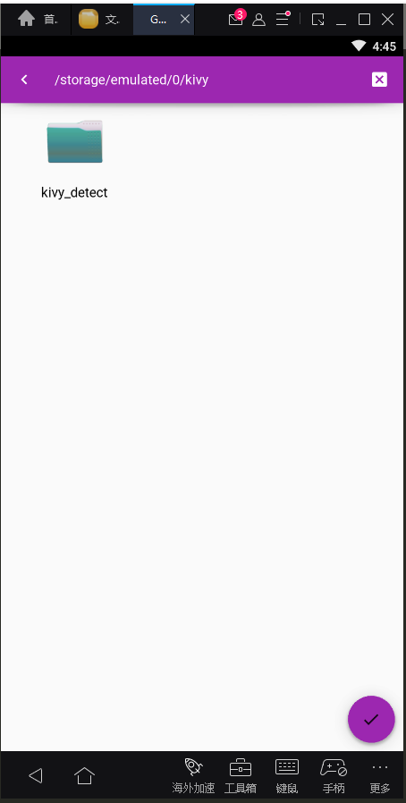 
</div>
<br>

+ 安卓手机


<div align=center>
 
</div>
<br>


<div align=center>
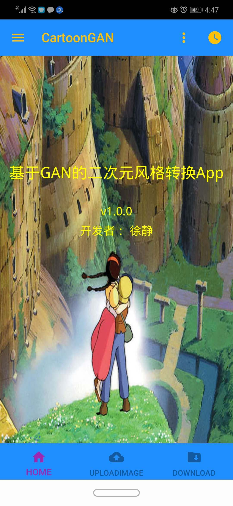 
</div>
<br>

<div align=center>
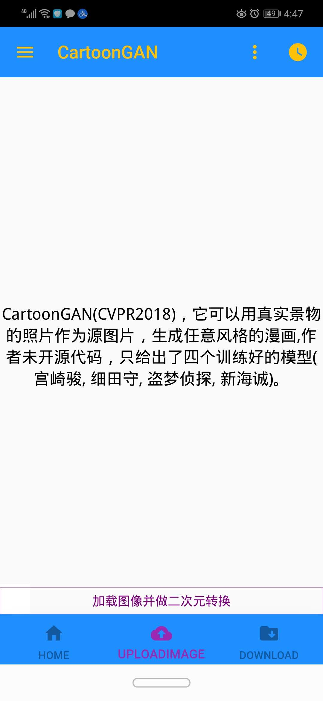 
</div>
<br>

<div align=center>
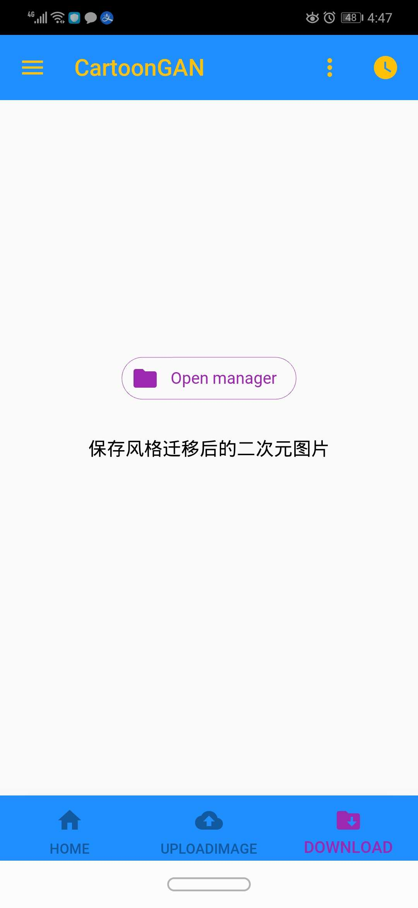 
</div>
<br>

<div align=center>
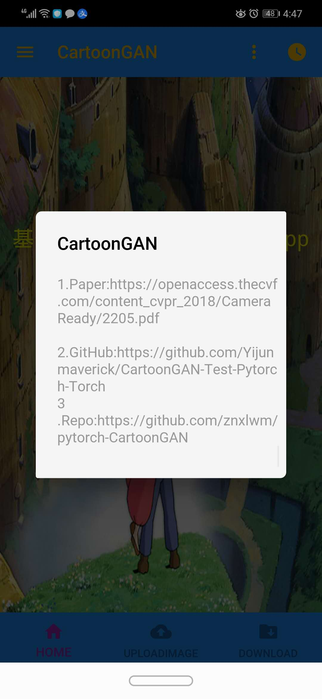 
</div>
<br>

<div align=center>
 
</div>
<br>

<div align=center>
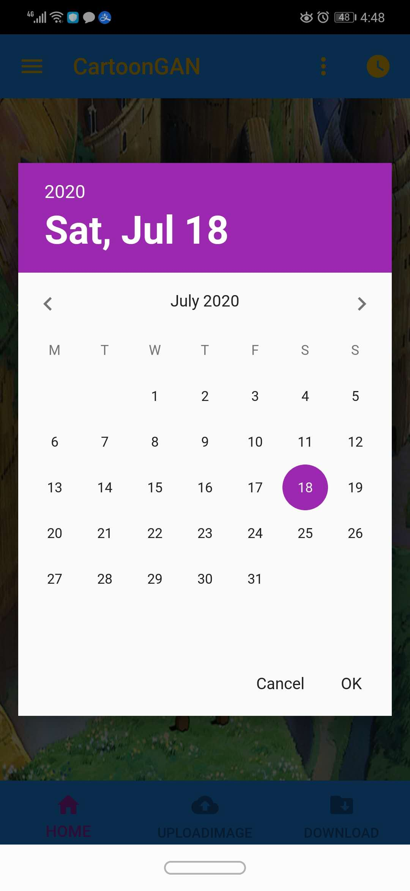 
</div>
<br>

<div align=center>
 
</div>
<br>
