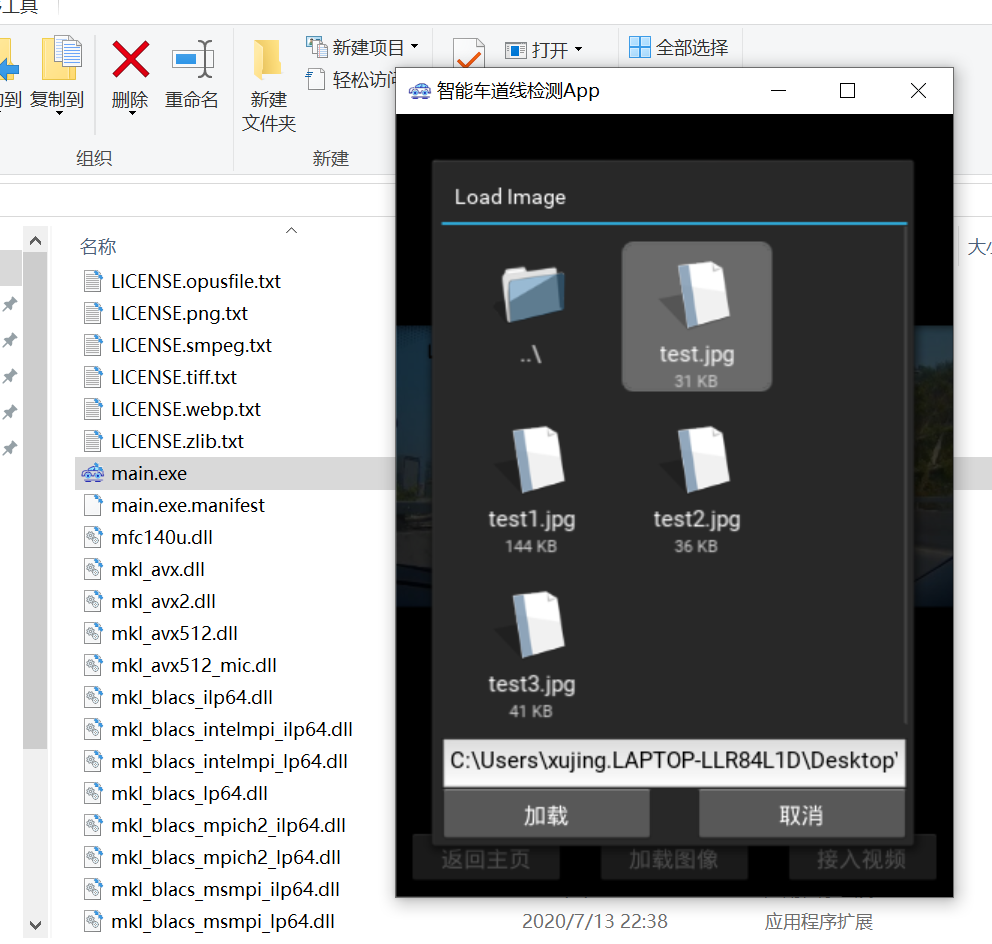
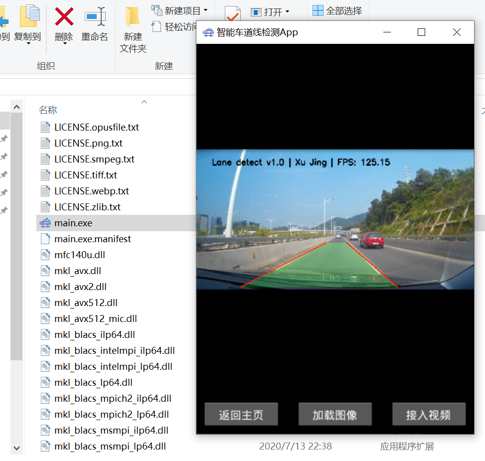

## 第六章 pyinstaller打包Windows桌面应用程序

### 以智能车道线检测项目Windows打包为例

------

我们使用pyinstaller在windows下打包开发的kivy应用程序，当然你也可以使用其他的打包方式比如：Nuitka,如果你没有安装pyinstaller,可以通过pip进行安装。

```
pip install pyinstaller -i https://pypi.tuna.tsinghua.edu.cn/simple
```

这里要说明的是，python的可执行文件打包会将整个python环境及所有的依赖进行打包，这样会导致打包的程序占用的空间较大，并且打包后的程序的开启速度不如C++等程序的开启速度快，这里笔者强烈推荐读者使用Nuitka进行打包，其程序的开启速度要比pyinstaller的开启速度快。

我们以第4章中的智能车道线检测项目为例，介绍pyinstaller如何打包kivy应用程序。

首先我们通过命令行生成打包的spec配置文件,cd到项目的同级目录并执行

```

pyinstaller -F -w --icon=static/icon.ico main.py

#pyinstaller的用法，在你想放置应用的文件夹下打开cmd，
#pyinstaller + 参数 +文件入口或打包定义文档。

#-F：生成一个文件夹，里面是多文件模式，启动快。
#-D：仅仅生成一个文件，不暴露其他信息，启动较慢。
#-w：窗口模式打包，不显示控制台。
#--icon：跟图标路径，作为应用icon。
#--hidden-import 应用需要的包，但是没有被打包进来，这里的错误是最多的，因为一般是第三方包隐式调用其他包，然后打包出来的程序显示Fate Error不能运行。

# 关于pyinstaller更多的参数可参考官方文档
```

这样在项目的同级目录下会生成以入口函数`main.spec`命名的spec打包的配置文件，我们修改该配置文件如下:

```
# -*- mode: python ; coding: utf-8 -*-

from kivy_deps import sdl2,glew  # 导入kivy_deps

block_cipher = None


a = Analysis(['main.py'],
             pathex=['C:\\Users\\xujing.LAPTOP-LLR84L1D\\Desktop\\车道线检测\\kivy'],
             binaries=[],
             datas=[],
             hiddenimports=[],
             hookspath=[],
             runtime_hooks=[],
             excludes=[],
             win_no_prefer_redirects=False,
             win_private_assemblies=False,
             cipher=block_cipher,
             noarchive=False)
pyz = PYZ(a.pure, a.zipped_data,
             cipher=block_cipher)
exe = EXE(pyz,
          a.scripts,
          [],
          exclude_binaries=True,
          name='main',
          debug=False,
          bootloader_ignore_signals=False,
          strip=False,
          upx=True,
          console=False , icon='static\\icon.ico')  # 修改是否开启命令行和icon
coll = COLLECT(exe,
               a.binaries,
               a.zipfiles,
               a.datas,
               *[Tree(p) for p in (sdl2.dep_bins+glew.dep_bins)], # exe包含的一些库打包进来
               strip=False,
               upx=True,
               upx_exclude=[],
               name='main')  # 打包的exe的名称

```


修改好spec文件后，我们使用spec文件进行打包，命令如下：

```
pyinstaller main.spec
```

打包过程很快会完成，会在项目的同级目录下生成build文件夹和dist文件夹，build文件夹存放了打包的临时文件，打包完成后可以删除，dist文件夹存放了打包后的可执行文件及其依赖，我们将打包过程中需要的静态文件和资源文件拷贝到dist文件夹。此时的命令行提示如下，说明打包成功：

```
123947 INFO: Appending archive to EXE C:\Users\xujing.LAPTOP-LLR84L1D\Desktop\新建文件夹 (2)\车道线检测1.0\kivy\build\main\main.exe
123963 INFO: Building EXE from EXE-00.toc completed successfully.
123963 INFO: checking Tree
123963 INFO: Building Tree because Tree-02.toc is non existent
123963 INFO: Building Tree Tree-02.toc
123978 INFO: checking Tree
123978 INFO: Building Tree because Tree-03.toc is non existent
123978 INFO: Building Tree Tree-03.toc
123978 INFO: checking COLLECT
123978 INFO: Building COLLECT because COLLECT-00.toc is non existent
123978 INFO: Building COLLECT COLLECT-00.toc
174714 INFO: Building COLLECT COLLECT-00.toc completed successfully.
```


<div align=center>
 
</div>
<br>

<div align=center>
 
</div>
<br>

<div align=center>
 
</div>
<br>

<div align=center>
 
</div>
<br>
