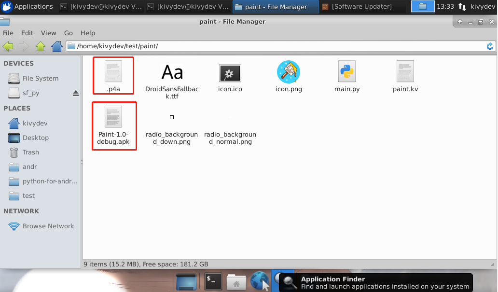
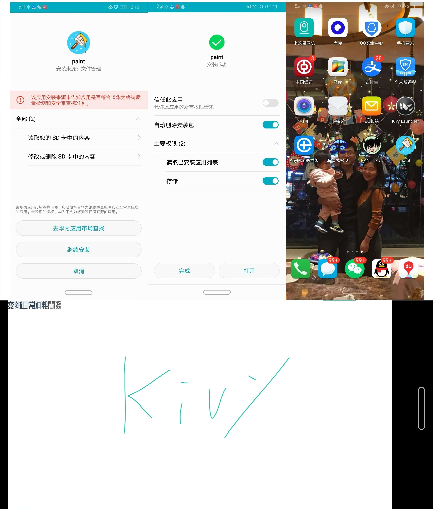

## 第八章 p4a Android打包基于kivy的涂鸦画板项目

------

python-for-android简称p4a是kivy应用打包成apk的一种方法，使用p4a需要手动下载Android SDK和Android NDK的安装包，随后安装构建工具，配置SDK和NDK的环境变量，值得注意的是该方法只能在Linux平台上打包，关于安装和p4a的介绍，可以参考<https://python-for-android.readthedocs.io/en/latest/>,如果需要本课程将提供一个已经完全设置好的虚拟机，该虚拟机来源于《Python+kivy(App开发)从入门到实践》


<div align=center>
 
</div>


### 1.基于Kivy开发的涂鸦画板项目的p4a安卓打包及项目演示

首先通过如下命令清除其他apk中的builds和dists文件夹，对于同一个apk,该命令只执行一次即可。
```
p4a clean_builds && p4a clean_dists

```
```
kivydev@kivydev-VirtualBox:~/test/paint$ p4a clean_builds && p4a clean_dists
[INFO]:    Reading .p4a configuration
[INFO]:    Recipe python3crystax: version "3.6" requested
[INFO]:    Reading .p4a configuration
[INFO]:    Recipe python3crystax: version "3.6" requested

```

自动生成的`.p4a`文件，如下：

```
--dist_name Paint
--android_api 19
--minsdk 19
--sdk_dir /home/kivydev/andr/android-sdk-linux
--ndk_dir /home/kivydev/andr/crystax-ndk-10.3.2

--arch armeabi-v7a
--requirements python3crystax==3.6,kivy
--private .
--package com.xujing.paint
--name paint
--version 1.0
--orientation landscape 
--bootstrap sdl2 
--icon icon.png

```

随后通过以下命令打包apk

```
p4a apk --debug
```

```
[INFO]:    Reading .p4a configuration
[INFO]:    Recipe python3crystax: version "3.6" requested
[INFO]:    Will compile for the following archs: armeabi-v7a
[INFO]:    Getting Android API version from user argument
[INFO]:    Available Android APIs are (19, 23, 27)
[INFO]:    Requested API target 19 is available, continuing.
[INFO]:    Getting NDK dir from from user argument
[INFO]:    Got NDK version from $ANDROIDNDKVER
[INFO]:    Got Android NDK version from the NDK dir: it is 10.3.2
[INFO]:    Using Crystax NDK 10.3.2
[INFO]:    Found virtualenv at /usr/bin/virtualenv
[INFO]:    Found the following toolchain versions: ['4.9', '5', 'clang3.6', 'clang3.7']
[INFO]:    Picking the latest gcc toolchain, here 5
[INFO]:    Of the existing distributions, the following meet the given requirements:
[INFO]:    	Paint: includes recipes (hostpython3crystax, sdl2_image, sdl2_mixer, sdl2_ttf, python3crystax, sdl2, six, pyjnius, kivy), built for archs (armeabi-v7a)
[INFO]:    Paint has compatible recipes, using this one
[INFO]:    Of the existing distributions, the following meet the given requirements:
[INFO]:    	Paint: includes recipes (hostpython3crystax, sdl2_image, sdl2_mixer, sdl2_ttf, python3crystax, sdl2, six, pyjnius, kivy), built for archs (armeabi-v7a)
[INFO]:    Paint has compatible recipes, using this one
Could not find hostpython, will not compile to .pyo (this is normal with python3)
[INFO]:    -> directory context /home/kivydev/.local/share/python-for-android/dists/Paint
No compiled python is present to zip, skipping.
this should only be the case if you are using the CrystaX python
[INFO]:    Selecting java build tool:
[INFO]:    Detected highest available build tools version to be 28.0.3
[INFO]:        Building with gradle, as gradle executable is present
[DEBUG]:   -> running gradlew assembleDebug
[DEBUG]:   	> Configuring > 0/1 projects > root project > Resolving dependenIncremental java compilation is an incubating feature.
[DEBUG]:   	:preBuild UP-TO-DATE
[DEBUG]:   	:preDebugBuild UP-TO-DATE
[DEBUG]:   	:checkDebugManifest
[DEBUG]:   	:prepareDebugDependencies
[DEBUG]:   	:compileDebugAidl UP-TO-DATE
[DEBUG]:   	:compileDebugRenderscript UP-TO-DATE
[DEBUG]:   	:generateDebugBuildConfig UP-TO-DATE
[DEBUG]:   	:generateDebugResValues UP-TO-DATE
[DEBUG]:   	:generateDebugResources UP-TO-DATE
[DEBUG]:   	:mergeDebugResources
[DEBUG]:   	:processDebugManifest UP-TO-DATE
[DEBUG]:   	:processDebugResources
[DEBUG]:   	:generateDebugSources
[DEBUG]:   	:incrementalDebugJavaCompilationSafeguard UP-TO-DATE
[DEBUG]:   	:javaPreCompileDebug
[DEBUG]:   	:compileDebugJavaWithJavac UP-TO-DATE
[DEBUG]:   	:compileDebugNdk UP-TO-DATE
[DEBUG]:   	:compileDebugSources UP-TO-DATE
[DEBUG]:   	:mergeDebugShaders UP-TO-DATE
[DEBUG]:   	:compileDebugShaders UP-TO-DATE
[DEBUG]:   	:generateDebugAssets UP-TO-DATE
[DEBUG]:   	:mergeDebugAssets
[DEBUG]:   	:transformClassesWithDexForDebug UP-TO-DATE
[DEBUG]:   	:mergeDebugJniLibFolders UP-TO-DATE
[DEBUG]:   	:transformNativeLibsWithMergeJniLibsForDebug UP-TO-DATE
[DEBUG]:   	:transformNativeLibsWithStripDebugSymbolForDebug UP-TO-DATE
[DEBUG]:   	:processDebugJavaRes UP-TO-DATE
[DEBUG]:   	:transformResourcesWithMergeJavaResForDebug UP-TO-DATE
[DEBUG]:   	:validateSigningDebug
[DEBUG]:   	:packageDebug
[DEBUG]:   	:assembleDebug
[DEBUG]:   	
[DEBUG]:   	BUILD SUCCESSFUL
[DEBUG]:   	
[DEBUG]:   	Total time: 6.116 secs
[DEBUG]:   	
[INFO]:    <- directory context /home/kivydev/test/paint
[INFO]:    # Copying APK to current directory
[INFO]:    # APK filename not found in build output, trying to guess
[INFO]:    # Found APK file: /home/kivydev/.local/share/python-for-android/dists/Paint/build/outputs/apk/Paint-debug.apk
[INFO]:    # Add version number to APK
[INFO]:    # APK renamed to Paint-1.0-debug.apk
[DEBUG]:   -> running cp /home/kivydev/.local/share/python-for-android/dists/Paint/build/outputs/apk/Paint-debug.apk Paint-1.0-debug.apk

```

打包完成后会生成apk文件，把apk文件复制到共享文件夹，并在手机或安卓模拟器中安装。


<div align=center>
 
</div>


### 2.MUMU安卓模拟器及adb_server.exe调试

我们将打包好的apk文件安装在安卓模拟器，并通过安卓模拟器提供的adb_server.exe多apk进行调试

首先我们将刚刚打包好的apk文件安装到安卓模拟器：

<div align=center >
 
</div>

打开我们安装的安卓程序

<div align=center >
 
</div>

可以正常工作。

我们通过MUMU安卓模拟器自带的adb_server.exe调试看一下后台运行的日志

```
cmd
cd D:\soft_xj\MUMU\emulator\nemu\vmonitor\bin

adb_server.exe connect 127.0.0.1:7555
```
<div align=center >
 
</div>

```
adb_server.exe shell
run-as com.xujing.paint
cd files/app/.kivy/logs

cat kivy_20-07-09_1.txt
```
<div align=center >
 
</div>

没有ERROR同时我们的安卓程序并没有闪退，运行正常，如果过程中我们的程序出现闪退或错误，请按照上述方式进行调试，寻找原因。


### 3.adb安卓调试

最后我们将p4a打包的安卓程序安装运行在我们的华为安卓手机上，首先我们经apk安装在我们的华为手机上

<div align=center >
 
</div>

我们使用adb调试我们安卓手机上的apk应用

```
adb shell
run-as com.xujing.paint
cd files/app/.kivy/logs
cat kivy_20-07-09_1.txt

```
<div align=center >
 
</div>


